# Human Manual

## What This Pack Helps With

load Continue as a source-controlled coding-agent workflow with policy checks, eval prompts, and recovery rules for unsafe or drifting code suggestions

## How To Use

1. Read `README.md`.
2. Load `AGENTS.md` or `CLAUDE.md`.
3. Run evals.
4. Use pitfall and risk files to recover from failure.

## What This Pack Does Not Do

- It does not replace upstream docs.
- It does not prove production readiness.
- It does not claim official endorsement.

## Doramagic Source Extract

# https://github.com/continuedev/continue 项目说明书

生成时间：2026-05-13 06:37:27 UTC

## 目录

- [Continue项目简介](#introduction)
- [项目目录结构](#project-structure)
- [系统架构设计](#system-architecture)
- [通信协议与消息传递](#communication-protocols)
- [LLM集成架构](#llm-integration)
- [模型提供商支持](#model-providers)
- [自动补全系统](#autocomplete-system)
- [代码库索引系统](#codebase-indexing)
- [上下文提供者](#context-providers)
- [VSCode扩展](#vscode-extension)

<a id='introduction'></a>

## Continue项目简介

### 相关页面

相关主题：[项目目录结构](#project-structure), [系统架构设计](#system-architecture)

<details>
<summary>相关源码文件</summary>

以下源码文件用于生成本页说明：

- [README.md](https://github.com/continuedev/continue/blob/main/README.md)
- [extensions/cli/src/slashCommands.ts](https://github.com/continuedev/continue/blob/main/extensions/cli/src/slashCommands.ts)
- [extensions/cli/src/systemMessage.ts](https://github.com/continuedev/continue/blob/main/extensions/cli/src/systemMessage.ts)
- [gui/src/components/StyledMarkdownPreview/utils/patchNestedMarkdown.ts](https://github.com/continuedev/continue/blob/main/gui/src/components/StyledMarkdownPreview/utils/patchNestedMarkdown.ts)
- [gui/src/pages/stats.tsx](https://github.com/continuedev/continue/blob/main/gui/src/pages/stats.tsx)
- [extensions/cli/src/ui/IntroMessage.tsx](https://github.com/continuedev/continue/blob/main/extensions/cli/src/ui/IntroMessage.tsx)
- [gui/src/pages/config/sections/ModelsSection.tsx](https://github.com/continuedev/continue/blob/main/gui/src/pages/config/sections/ModelsSection.tsx)
</details>

# Continue项目简介

## 项目概述

Continue 是一个开源的 AI 编程助手项目，旨在为开发者提供智能化的代码辅助功能。该项目支持多种 IDE 集成，并通过可配置的 AI 模型实现代码生成、补全、编辑和检查等功能。

### 核心定位

Continue 的核心价值主张包括：

- **Source-controlled AI checks**: 支持在 CI/CD 流程中强制执行的源代码级别 AI 检查
- **跨平台支持**: 提供 VS Code 和 IntelliJ IDEA 等主流 IDE 的扩展
- **CLI 工具**: 提供独立的命令行工具 (`cn`) 便于集成到开发工作流中
- **可扩展架构**: 支持自定义模型配置和 MCP (Model Context Protocol) 服务器集成

### 主要功能模块

| 模块 | 功能描述 |
|------|----------|
| GUI 组件 | 前端界面组件，包括 Markdown 预览、模型选择器、配置面板等 |
| CLI 扩展 | 命令行工具，支持斜杠命令、资源监控等 |
| Core 核心 | 核心业务逻辑和 Markdown 处理工具 |
| IntelliJ 扩展 | JetBrains IDE 集成支持 |

---

## 系统架构

### 整体架构图

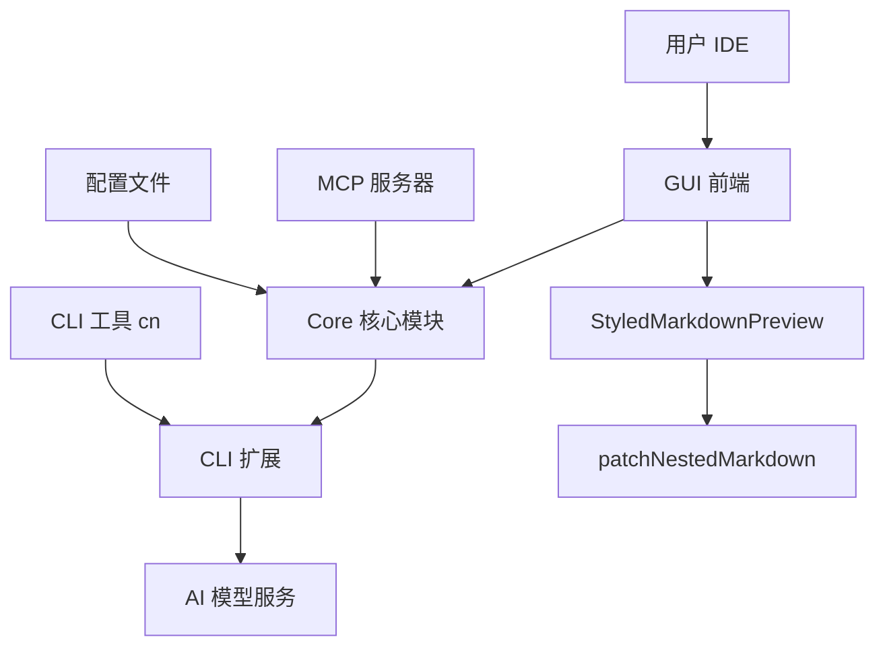

### 模块依赖关系

根据源码结构，项目主要分为以下层级：

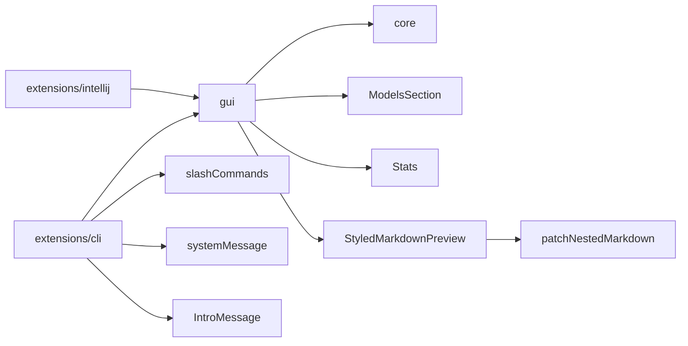

---

## 核心功能详解

### 1. 斜杠命令系统

Continue 实现了丰富的斜杠命令（Slash Commands）系统，用户可通过输入 `/` 开头的命令快速触发特定功能。 资料来源：[extensions/cli/src/slashCommands.ts:1-70]()

#### 支持的命令列表

| 命令 | 功能描述 |
|------|----------|
| `/clear` | 清除聊天历史记录 |
| `/exit` | 退出当前会话 |
| `/config` | 打开配置选择器 |
| `/login` | 登录认证 |
| `/logout` | 登出 |
| `/whoami` | 显示当前用户信息 |
| `/model` | 打开模型选择器 |
| `/compact` | 压缩会话历史 |
| `/mcp` | 打开 MCP 服务器选择器 |
| `/resume` | 恢复历史会话 |
| `/fork` | 复制当前会话 |
| `/title` | 为当前会话生成标题 |
| `/init` | 初始化新项目 |
| `/update` | 检查更新 |
| `/jobs` | 查看后台任务 |
| `/skills` | 管理技能包 |
| `/sessions` | 管理会话列表 |
| `/export` | 导出会话数据 |
| `/import` | 导入会话数据 |

#### 命令处理流程

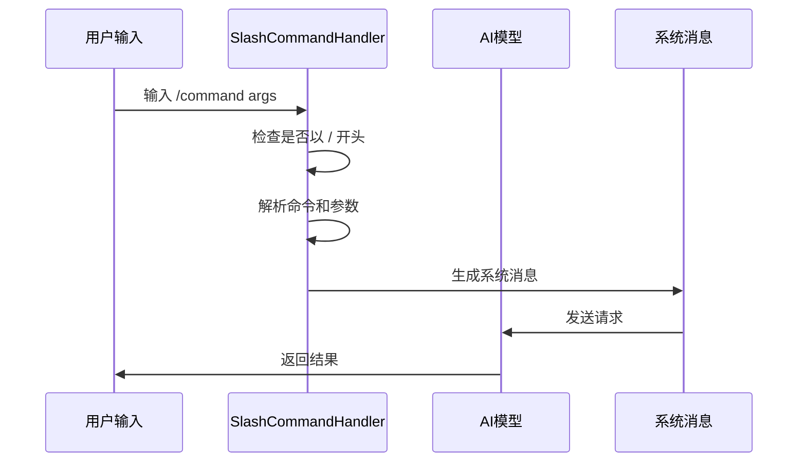

### 2. Markdown 嵌套处理

项目实现了一个专门的 Markdown 修补工具，用于处理包含代码块的 Markdown 内容，防止嵌套代码块渲染错误。 资料来源：[gui/src/components/StyledMarkdownPreview/utils/patchNestedMarkdown.ts:1-40]()

#### 功能说明

当用户生成的 Markdown 内容包含代码块时，该工具会：

1. 检测 Markdown 代码块模式（包括 `md`、`markdown`、`gfm`、`github-markdown` 等变体）
2. 使用 `~~~` 替代内层代码块的 ``` 分隔符
3. 维护嵌套层级计数，确保正确闭合

#### 核心算法

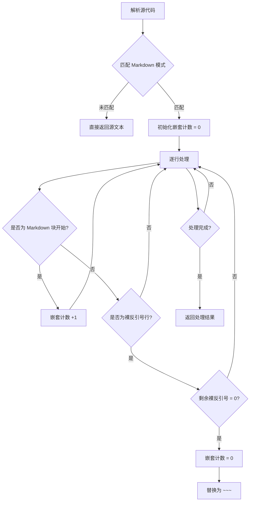

### 3. 系统消息生成

CLI 模块负责生成发送给 AI 模型的系统消息，包含上下文信息和配置指令。 资料来源：[extensions/cli/src/systemMessage.ts:1-60]()

#### 系统消息组件

| 组件 | 说明 |
|------|------|
| 提交签名信息 | 在提交消息中添加 Co-Authored-By 签名 |
| 简洁模式 | headless 模式下仅返回最终答案 |
| JSON 输出模式 | 当请求 JSON 格式时，生成专用的格式说明 |
| 用户规则 | 包含代理内容和处理后的规则 |

### 4. 模型配置管理

GUI 模块提供了完整的模型配置界面，支持不同角色的模型选择。 资料来源：[gui/src/pages/config/sections/ModelsSection.tsx:1-80]()

#### 模型角色分类

| 角色 | 用途描述 |
|------|----------|
| Chat | 通用对话和代码生成 |
| Autocomplete | 实时代码补全（边打字边补全） |
| Edit | 代码转换和编辑（多行选择区域） |

---

## 数据统计系统

项目集成了使用量统计功能，跟踪和展示令牌（Token）消耗情况。 资料来源：[gui/src/pages/stats.tsx:1-80]()

### 统计维度

| 维度 | 数据类型 | 说明 |
|------|----------|------|
| 按日期 | 日报表 | 每日生成的令牌数和提示令牌数 |
| 按模型 | 模型报表 | 各模型生成的令牌数和提示令牌数 |

### 令牌格式处理

```typescript
// 使用千位分隔符格式化数字
.toLocaleString()
```

---

## 资源监控

CLI 模块提供了资源调试工具栏，实时显示系统资源使用情况。 资料来源：[extensions/cli/src/ui/components/ResourceDebugBar.tsx:1-40]()

### 监控指标

| 指标 | 描述 |
|------|------|
| Peak Memory | 峰值内存使用量 |
| Peak CPU | 峰值 CPU 使用率 |
| Average Memory | 平均内存使用量 |
| Average CPU | 平均 CPU 使用率 |

---

## 安装与配置

### CLI 安装方式

#### macOS / Linux

```bash
curl -fsSL https://raw.githubusercontent.com/continuedev/continue/main/extensions/cli/scripts/install.sh | bash
```

#### Windows (PowerShell)

```powershell
irm https://raw.githubusercontent.com/continuedev/continue/main/extensions/cli/scripts/install.ps1 | iex
```

#### npm 安装

```bash
npm i -g @continuedev
```

### IDE 集成

项目提供以下 IDE 扩展：

- **VS Code**: 通过市场安装
- **IntelliJ IDEA**: 通过插件市场安装（需要 Node.js 20+）

---

## MCP 服务器集成

Continue 支持 MCP (Model Context Protocol) 服务器扩展，允许集成外部工具和服务。

### MCP 集成功能

| 功能 | 说明 |
|------|------|
| MCP 提示 | 显示可用的 MCP 提示模板 |
| MCP 服务器 | 管理和连接 MCP 服务器 |
| 工具调用 | 通过 MCP 协议调用外部工具 |

---

## 错误处理

项目实现了健壮的错误处理机制，包括错误通知组件和配置加载状态管理。 资料来源：[gui/src/components/config/FatalErrorNotice.tsx:1-50]()

### 错误处理策略

| 场景 | 处理方式 |
|------|----------|
| 配置加载失败 | 显示错误提示，提供重载选项 |
| 模型不可用 | 禁用聊天功能，提示用户配置模型 |
| 网络错误 | 显示重连选项和帮助文档链接 |

---

## 技术栈总结

### 前端技术

- **框架**: React
- **样式**: Tailwind CSS
- **图标**: Heroicons

### 后端/CLI 技术

- **运行环境**: Node.js 20+
- **包管理**: npm

### 许可证

项目采用 Apache 2.0 开源许可证 资料来源：[README.md:1-10]()

---

## 总结

Continue 是一个功能完整的 AI 编程助手，通过模块化的架构设计实现了：

1. **多 IDE 支持** - 覆盖主流开发环境
2. **灵活的命令系统** - 提高用户操作效率
3. **智能 Markdown 处理** - 解决嵌套渲染问题
4. **完善的统计监控** - 跟踪资源使用情况
5. **可扩展的 MCP 集成** - 支持第三方服务连接

该项目持续活跃开发中，通过配置文件和斜杠命令为开发者提供了高度可定制的 AI 辅助编程体验。

---

<a id='project-structure'></a>

## 项目目录结构

### 相关页面

相关主题：[Continue项目简介](#introduction), [系统架构设计](#system-architecture)

<details>
<summary>相关源码文件</summary>

以下源码文件用于生成本页说明：

- [gui/src/components/StyledMarkdownPreview/utils/patchNestedMarkdown.test.ts](https://github.com/continuedev/continue/blob/main/gui/src/components/StyledMarkdownPreview/utils/patchNestedMarkdown.test.ts)
- [extensions/cli/src/systemMessage.ts](https://github.com/continuedev/continue/blob/main/extensions/cli/src/systemMessage.ts)
- [gui/src/pages/config/sections/HelpSection.tsx](https://github.com/continuedev/continue/blob/main/gui/src/pages/config/sections/HelpSection.tsx)
- [extensions/cli/src/ui/IntroMessage.tsx](https://github.com/continuedev/continue/blob/main/extensions/cli/src/ui/IntroMessage.tsx)
- [gui/src/pages/config/sections/ModelsSection.tsx](https://github.com/continuedev/continue/blob/main/gui/src/pages/config/sections/ModelsSection.tsx)
- [gui/src/components/ModeSelect/ModeSelect.tsx](https://github.com/continuedev/continue/blob/main/gui/src/components/ModeSelect/ModeSelect.tsx)
- [gui/src/components/config/FatalErrorNotice.tsx](https://github.com/continuedev/continue/blob/main/gui/src/components/config/FatalErrorNotice.tsx)
- [extensions/cli/src/ui/JobsSelector.tsx](https://github.com/continuedev/continue/blob/main/extensions/cli/src/ui/JobsSelector.tsx)
</details>

# 项目目录结构

## 概述

Continue 是一个开源的 AI 编程助手项目，采用多模块 monorepo 架构组织。项目的目录结构清晰地划分了核心功能、图形界面、扩展插件和共享包等模块，便于维护和扩展。资料来源：[gui/src/pages/config/sections/HelpSection.tsx:1-50]()

## 顶层目录架构

```
continue/
├── core/                    # 核心逻辑模块
├── gui/                     # 图形用户界面
├── extensions/              # IDE 扩展插件
│   ├── cli/                 # 命令行工具
│   ├── intellij/            # IntelliJ IDE 插件
│   └── vscode/              # VS Code 插件
├── packages/                # 共享工具包
│   └── config-yaml/         # 配置解析工具
└── media/                   # 静态资源文件
```

## 核心模块（core）

核心模块包含项目的主要业务逻辑，处理 AI 模型交互、上下文管理和检查规则等核心功能。资料来源：[extensions/cli/src/systemMessage.ts:1-30]()

## 图形界面模块（gui）

gui 模块是使用 React 构建的跨平台图形界面，提供用户交互和配置管理功能。

### 页面组件结构

```
gui/src/pages/
├── config/
│   └── sections/
│       ├── HelpSection.tsx      # 帮助与工具配置
│       └── ModelsSection.tsx    # 模型配置管理
└── error.tsx                    # 错误页面
```

### 组件结构

```
gui/src/components/
├── StyledMarkdownPreview/       # Markdown 渲染组件
│   └── utils/
│       └── patchNestedMarkdown.test.ts
├── config/
│   └── FatalErrorNotice.tsx     # 错误提示组件
├── mainInput/
│   └── belowMainInput/
│       └── ContextItemsPeek.tsx # 上下文预览组件
├── ModeSelect/                  # 模式选择组件
│   └── ModeSelect.tsx
├── modelSelection/             # 模型选择组件
│   └── ModelCard.tsx
├── StepContainer/              # 步骤容器组件
│   └── ConversationSummary.tsx  # 对话摘要组件
└── BackgroundMode/             # 后台模式组件
    └── BackgroundModeView.tsx
```

### 配置路由

gui 模块定义了配置相关的路由结构，用于导航到不同的配置页面。资料来源：[gui/src/components/config/FatalErrorNotice.tsx:1-40]()

```typescript
const CONFIG_ROUTES = {
  CONFIG: "config",
  CONFIGS: "configs"
};
```

## 命令行扩展（extensions/cli）

cli 扩展提供了命令行界面，用于在终端环境中使用 Continue 的功能。

### CLI 模块结构

```
extensions/cli/src/
├── systemMessage.ts      # 系统消息处理
└── ui/
    ├── IntroMessage.tsx  # 介绍信息组件
    └── JobsSelector.tsx  # 任务选择器组件
```

### UI 组件功能

| 组件 | 功能 | 文件位置 |
|------|------|----------|
| IntroMessage | 显示启动信息、模型状态、能力警告 | [extensions/cli/src/ui/IntroMessage.tsx:1-80]() |
| JobsSelector | 任务列表选择与管理 | [extensions/cli/src/ui/JobsSelector.tsx:1-60]() |
| systemMessage | 生成系统提示信息 | [extensions/cli/src/systemMessage.ts:1-50]() |

### 系统消息生成

cli 模块通过 systemMessage.ts 生成传递给 AI 模型的系统消息，包含提交签名配置、headless 模式指令、JSON 输出格式要求等。资料来源：[extensions/cli/src/systemMessage.ts:1-30]()

## 配置模块（packages/config-yaml）

packages/config-yaml 模块提供了配置文件解析功能，支持 YAML 格式的配置文件处理。

## IDE 扩展

### 扩展类型

| 扩展名称 | 目录路径 | 说明 |
|----------|----------|------|
| VS Code | extensions/vscode/ | VS Code 集成 |
| IntelliJ | extensions/intellij/ | IntelliJ IDEA 集成 |
| Vim | extensions/vim/ | Vim/Neovim 集成 |

### 共享模式选择

各扩展共享相同的模式选择逻辑，支持四种主要模式：资料来源：[gui/src/components/ModeSelect/ModeSelect.tsx:1-100]()

```typescript
type Mode = "chat" | "plan" | "agent" | "background";
```

| 模式 | 功能描述 | 可用工具 |
|------|----------|----------|
| chat | 对话模式 | AI 对话工具 |
| plan | 规划模式 | 只读/MCP 工具 |
| agent | 代理模式 | 全部可用工具 |
| background | 后台模式 | 后台代理任务 |

## 配置系统

### 帮助与工具配置

HelpSection 组件提供了多项工具配置入口，包括令牌使用统计、会话历史查看、快速入门教程等。资料来源：[gui/src/pages/config/sections/HelpSection.tsx:1-80]()

### 模型配置

ModelsSection 组件管理不同角色的模型配置：

| 角色 | 用途 | 说明 |
|------|------|------|
| chat | 对话模型 | 用于聊天交互 |
| autocomplete | 自动补全 | 内联代码补全 |
| edit | 编辑模型 | 代码转换与修改 |

资料来源：[gui/src/pages/config/sections/ModelsSection.tsx:1-100]()

### 错误处理

FatalErrorNotice 组件在配置加载失败时显示错误提示，提供帮助链接、重新加载和查看配置页面的选项。资料来源：[gui/src/components/config/FatalErrorNotice.tsx:1-50]()

## 后台模式架构

BackgroundModeView 组件处理后台代理任务，提供了 GitHub 连接提示、任务状态显示和容器启动等待等功能。资料来源：[gui/src/components/BackgroundMode/BackgroundModeView.tsx:1-60]()

## 工作流程图

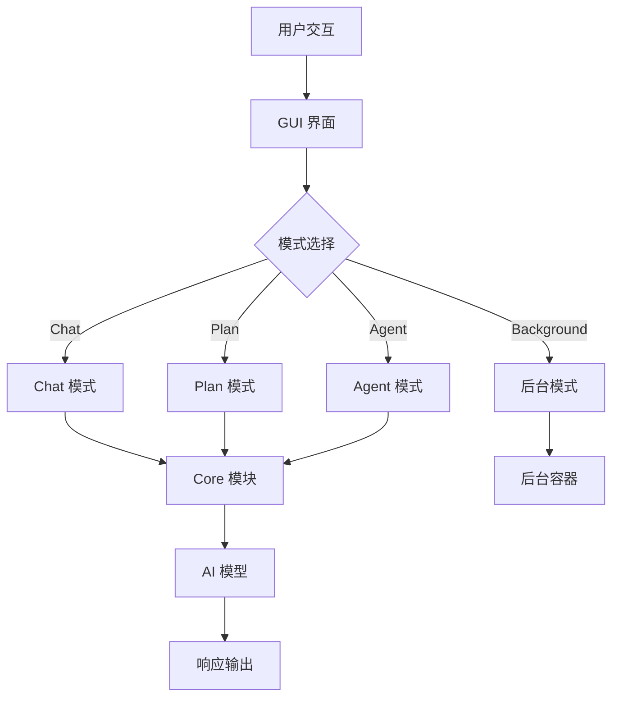

## 模块间依赖关系

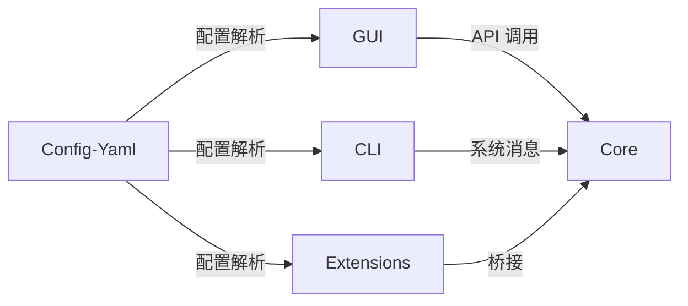

## 关键文件索引

| 功能模块 | 主要文件 | 职责 |
|----------|----------|------|
| 系统消息 | extensions/cli/src/systemMessage.ts | 生成 AI 系统提示 |
| 模式选择 | gui/src/components/ModeSelect/ModeSelect.tsx | 管理四种工作模式 |
| 模型配置 | gui/src/pages/config/sections/ModelsSection.tsx | 配置 AI 模型 |
| 错误处理 | gui/src/components/config/FatalErrorNotice.tsx | 错误提示与恢复 |
| 后台代理 | gui/src/components/BackgroundMode/BackgroundModeView.tsx | 后台任务管理 |

---

<a id='system-architecture'></a>

## 系统架构设计

### 相关页面

相关主题：[Continue项目简介](#introduction), [通信协议与消息传递](#communication-protocols), [LLM集成架构](#llm-integration)

<details>
<summary>相关源码文件</summary>

以下源码文件用于生成本页说明：

- [gui/src/components/StyledMarkdownPreview/utils/patchNestedMarkdown.ts](https://github.com/continuedev/continue/blob/main/gui/src/components/StyledMarkdownPreview/utils/patchNestedMarkdown.ts)
- [extensions/cli/src/slashCommands.ts](https://github.com/continuedev/continue/blob/main/extensions/cli/src/slashCommands.ts)
- [extensions/cli/src/systemMessage.ts](https://github.com/continuedev/continue/blob/main/extensions/cli/src/systemMessage.ts)
- [gui/src/redux/slices/sessionSlice.ts](https://github.com/continuedev/continue/blob/main/gui/src/redux/slices/sessionSlice.ts)
- [gui/src/pages/stats.tsx](https://github.com/continuedev/continue/blob/main/gui/src/pages/stats.tsx)
- [gui/src/components/config/FatalErrorNotice.tsx](https://github.com/continuedev/continue/blob/main/gui/src/components/config/FatalErrorNotice.tsx)
- [extensions/cli/src/ui/IntroMessage.tsx](https://github.com/continuedev/continue/blob/main/extensions/cli/src/ui/IntroMessage.tsx)
</details>

# 系统架构设计

## 1. 概述

Continue 是一个开源的 AI 编程助手，通过 GitHub 状态检查和可配置的 AI 代理来增强开发工作流。系统采用多层次客户端-服务器架构，支持多种 IDE 集成，包括 Visual Studio Code、JetBrains 系列等。 资料来源：[README.md:1-30]()

Continue 的架构设计围绕以下核心目标展开：

- 提供源控制的 AI 代码检查功能，可在 CI 中强制执行
- 支持在任意编码代理中使用
- 通过 slash 命令提供丰富的交互体验
- 实现灵活的状态管理和会话追踪

## 2. 核心架构分层

### 2.1 整体架构概览

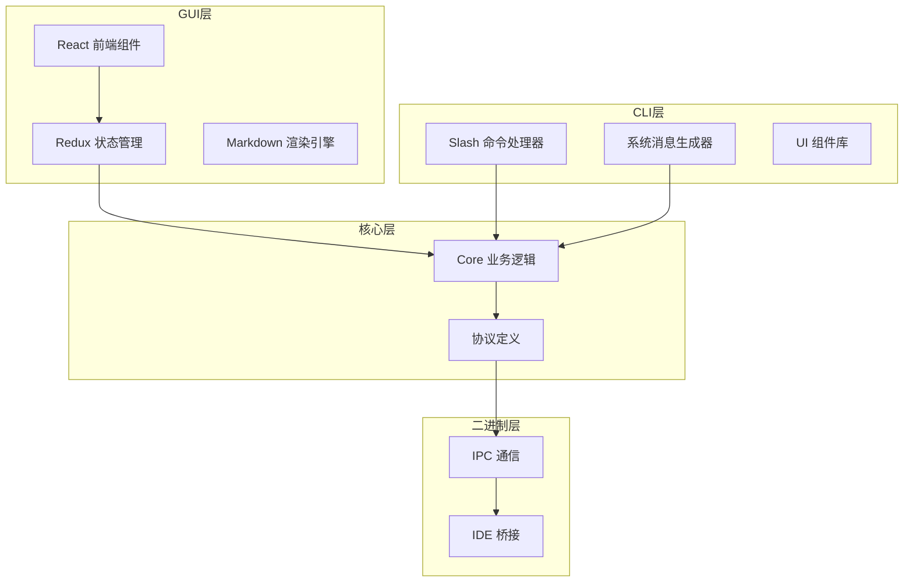

### 2.2 分层职责说明

| 层级 | 主要职责 | 技术栈 |
|------|----------|--------|
| GUI 层 | 用户界面渲染、交互处理、状态展示 | React, Redux, TypeScript |
| CLI 层 | 命令行交互、slash 命令处理、系统消息生成 | Node.js, React |
| 核心层 | 业务逻辑处理、协议定义、数据模型 | TypeScript |
| 二进制层 | IPC 通信、IDE 集成、低层交互 | Rust/TypeScript |

## 3. 状态管理架构

### 3.1 Redux Store 结构

Continue 使用 Redux Toolkit 管理前端状态，核心 store 包含多个 slice，其中 `sessionSlice` 是最重要的状态管理模块。 资料来源：[gui/src/redux/slices/sessionSlice.ts:1-100]()

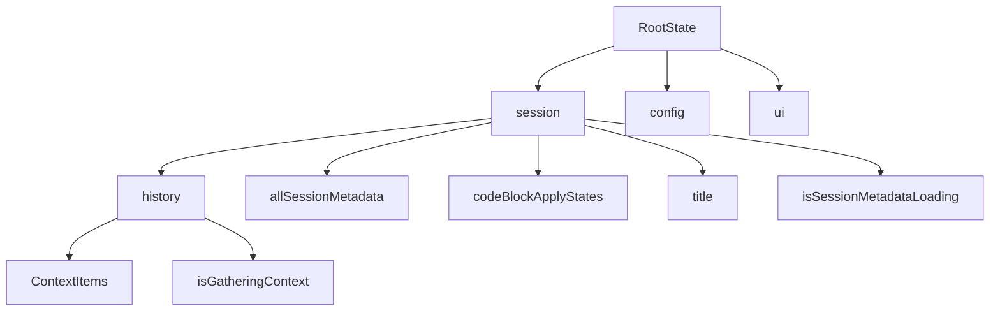

### 3.2 Session State 核心功能

Session State 负责管理聊天会话的完整生命周期，包括以下关键功能：

**会话元数据管理**

```typescript
// 添加新会话元数据
addSessionMetadata: (
  state,
  { payload }: PayloadAction<BaseSessionMetadata>,
) => {
  state.allSessionMetadata = [...state.allSessionMetadata, payload];
}

// 更新会话元数据
updateSessionMetadata: (
  state,
  {
    payload,
  }: PayloadAction<{
    sessionId: string;
  } & Partial<BaseSessionMetadata>>,
) => {
  state.allSessionMetadata = state.allSessionMetadata.map((session) =>
    session.sessionId === payload.sessionId
      ? { ...session, ...payload }
      : session,
  );
};
```

**选择器模式**

系统使用 `createSelector` 实现高效的派生状态计算：

```typescript
export const selectApplyStateByStreamId = createSelector(
  [
    (state: RootState) => state.session.codeBlockApplyStates.states,
    (_state: RootState, streamId?: string) => streamId,
  ],
  (states, streamId) => {
    return states.find((state) => state.streamId === streamId);
  },
);
```

### 3.3 异步操作处理

系统通过 AsyncThunk 和 `addPassthroughCases` 模式处理异步操作，确保流式响应的状态一致性。 资料来源：[gui/src/redux/slices/sessionSlice.ts:180-200]()

```typescript
function addPassthroughCases(
  builder: ActionReducerMapBuilder<SessionState>,
  thunks: AsyncThunk<any, any, any>[],
) {
  thunks.forEach((thunk) => {
    builder
      .addCase(thunk.fulfilled, (_state, _action) => {})
      .addCase(thunk.rejected, (_state, _action) => {})
      .addCase(thunk.pending, (_state, _action) => {});
  });
}
```

## 4. Slash 命令系统

### 4.1 命令处理架构

Slash 命令是 CLI 层的核心交互方式，支持多种系统操作。命令处理器采用映射表模式，便于扩展和维护。 资料来源：[extensions/cli/src/slashCommands.ts:1-80]()

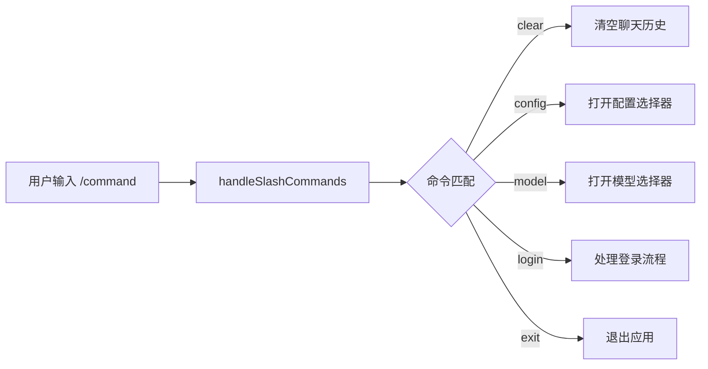

### 4.2 支持的命令列表

| 命令 | 功能描述 | 返回类型 |
|------|----------|----------|
| `/clear` | 清空聊天历史 | `{ clear: true, output: string }` |
| `/exit` | 退出 CLI | `{ exit: true, output: string }` |
| `/config` | 打开配置选择器 | `{ openConfigSelector: true }` |
| `/model` | 打开模型选择器 | `{ openModelSelector: true }` |
| `/compact` | 压缩会话历史 | `{ compact: true }` |
| `/mcp` | 打开 MCP 选择器 | `{ openMcpSelector: true }` |
| `/resume` | 恢复历史会话 | `{ openSessionSelector: true }` |
| `/title` | 生成会话标题 | 异步处理 |
| `/init` | 初始化新项目 | 异步处理 |
| `/update` | 打开更新选择器 | `{ openUpdateSelector: true }` |
| `/jobs` | 管理后台任务 | 异步处理 |
| `/skills` | 管理技能 | 异步处理 |

### 4.3 命令执行流程

```typescript
export async function handleSlashCommands(
  input: string,
  assistant: AssistantConfig,
  options?: { remoteUrl?: string; isRemoteMode?: boolean },
): Promise<SlashCommandResult | null> {
  // 仅在 slash 是第一个字符时触发
  if (!input.startsWith("/") || !input.trim().startsWith("/")) {
    return null;
  }

  const [command, ...args] = input.slice(1).split(" ");
  
  // 路由到对应处理器
  const handler = slashCommandMap[command];
  if (handler) {
    return await handler(args, assistant);
  }
  
  return null;
}
```

## 5. 系统消息生成

### 5.1 消息构建策略

系统消息生成器 (`systemMessage.ts`) 负责构建发送给 AI 模型的全上下文提示，包含多种可选的上下文模块。 资料来源：[extensions/cli/src/systemMessage.ts:1-60]()

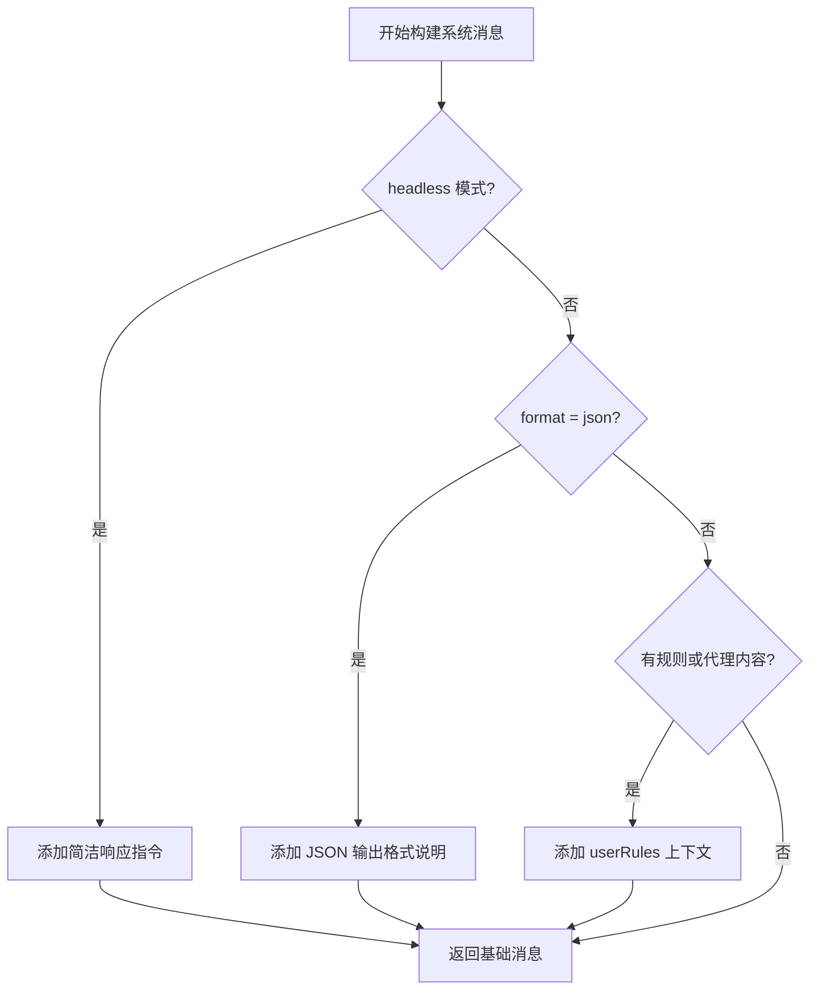

### 5.2 上下文模块

| 模块名称 | 触发条件 | 内容描述 |
|----------|----------|----------|
| `commitSignature` | `CONTINUE_CLI_DISABLE_COMMIT_SIGNATURE` 未设置 | Git 提交签名信息 |
| userRules | `agentContent` 或 `processedRules` 存在 | 用户定义的规则和代理内容 |
| 简洁响应指令 | `headless` 模式 | 要求直接返回最终答案 |
| JSON 格式说明 | `format === "json"` | JSON 输出格式规范 |

### 5.3 JSON 模式输出格式

当启用 JSON 输出模式时，系统会注入特定的格式化指令：

```typescript
if (format === "json") {
  systemMessage += `
IMPORTANT: You are operating in JSON output mode. 
Your final response MUST be valid JSON that can be parsed by JSON.parse().
The JSON should contain properties relevant to answer the user's question.
`;
}
```

## 6. 用户界面组件架构

### 6.1 组件层次结构

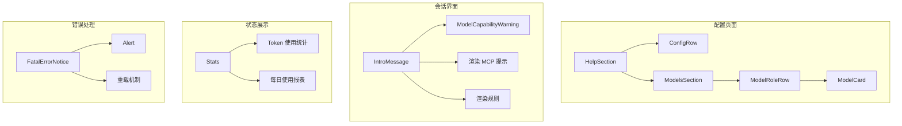

### 6.2 IntroMessage 组件

`IntroMessage` 是 CLI 界面的主要信息展示组件，负责显示配置状态和模型信息。 资料来源：[extensions/cli/src/ui/IntroMessage.tsx:1-60]()

**核心渲染逻辑**

```typescript
const IntroMessage: React.FunctionComponent<IntroMessageProps> = ({
  config,
  model,
  modelCapable,
  mcpServers,
  mcpPrompts,
  rules,
}) => {
  return (
    <Box>
      {/* 配置信息 */}
      {config && (
        <Text color="blue">
          <Text bold>Config:</Text> <Text color="white">{config.name}</Text>
        </Text>
      )}

      {/* 模型信息 */}
      {model ? (
        <Text color="blue">
          <Text bold>Model:</Text>{" "}
          <Text color="white">{model.name.split("/").pop()}</Text>
        </Text>
      ) : (
        <Text color="blue">
          <Text bold>Model:</Text> <Text color="dim">Loading...</Text>
        </Text>
      )}

      {/* 能力警告 */}
      {model && !modelCapable && (
        <ModelCapabilityWarning modelName={model.name} />
      )}
    </Box>
  );
};
```

### 6.3 模型选择组件

`ModelsSection` 负责管理不同角色的模型配置，包括聊天、补全和编辑模型。 资料来源：[gui/src/pages/config/sections/ModelsSection.tsx:1-50]()

| 角色 | 用途描述 | 快捷键 |
|------|----------|--------|
| chat | 对话和代码生成 | 默认 |
| autocomplete | 内联代码补全 | 默认 |
| edit | 代码转换和重构 | Cmd+I |

### 6.4 Stats 页面统计功能

`Stats` 组件展示令牌使用统计信息，支持按日和按模型两个维度的数据展示。 资料来源：[gui/src/pages/stats.tsx:1-80]()

```typescript
// 数据展示表格结构
<table className="w-full border-collapse">
  <thead>
    <Tr>
      <Th>Day/Model</Th>
      <Th>Generated Tokens</Th>
      <Th>Prompt Tokens</Th>
    </Tr>
  </thead>
  <tbody>
    {models.map((model) => (
      <Tr key={model.model}>
        <Td>{model.model}</Td>
        <Td>{model.generatedTokens.toLocaleString()}</Td>
        <Td>{model.promptTokens.toLocaleString()}</Td>
      </Tr>
    ))}
  </tbody>
</table>
```

## 7. Markdown 处理系统

### 7.1 嵌套代码块处理

系统实现了 `patchNestedMarkdown` 功能来处理 Markdown 中嵌套的代码块，确保正确渲染。 资料来源：[gui/src/components/StyledMarkdownPreview/utils/patchNestedMarkdown.ts:1-40]()

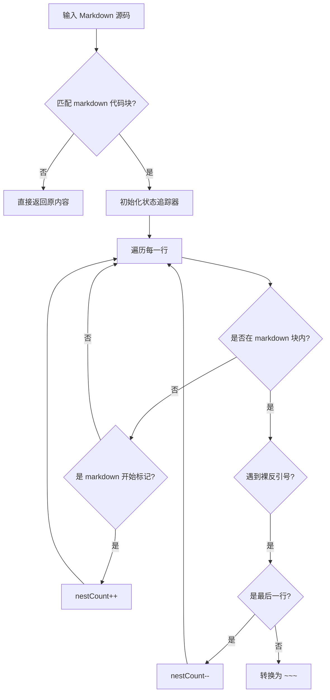

### 7.2 支持的 Markdown 标识符

| 标识符 | 说明 | 示例 |
|--------|------|------|
| `md` | 标准 Markdown | ````md` |
| `markdown` | 完整写法 | ````markdown` |
| `gfm` | GitHub Flavored Markdown | ````gfm` |
| `github-markdown` | GitHub 特定标识 | ````github-markdown` |

### 7.3 状态追踪器优化

系统使用 `MarkdownBlockStateTracker` 优化嵌套代码块的检测性能：

```typescript
export const patchNestedMarkdown = (source: string): string => {
  // 早期返回优化
  if (!source.match(/```(\w*|.*)(md|markdown|gfm|github-markdown)/))
    return source;

  let nestCount = 0;
  const lines = source.split("\n");

  // 使用优化的状态追踪器
  const stateTracker = new MarkdownBlockStateTracker(lines);
  const trimmedLines = stateTracker.getTrimmedLines();

  for (let i = 0; i < trimmedLines.length; i++) {
    const line = trimmedLines[i];

    if (nestCount > 0) {
      if (stateTracker.isBareBacktickLine(i)) {
        // 处理裸反引号行
        const remainingBareBackticks =
          stateTracker.getRemainingBareBackticksAfter(i);

        if (remainingBareBackticks === 0) {
          nestCount = 0;
          lines[i] = "~~~";
        }
      }
    }
  }
};
```

## 8. 错误处理与恢复

### 8.1 FatalErrorNotice 组件

`FatalErrorNotice` 组件负责展示致命错误状态，提供用户恢复选项。 资料来源：[gui/src/components/config/FatalErrorNotice.tsx:1-60]()

```mermaid
graph TD
    A[检测到错误状态] --> B[显示错误提示]
    B --> C{配置加载中?}
    C -->|是| D[显示 "Reloading..."]
    C -->|否| E[显示操作选项]
    E --> F[帮助文档链接]
    E --> G[重新加载按钮]
    E --> H{当前路径非配置页?} 
    H -->|是| I[显示查看按钮]
```

### 8.2 恢复机制

| 操作 | 触发方式 | 功能 |
|------|----------|------|
| 帮助 | 点击"Help"链接 | 打开故障排除文档 |
| 重新加载 | 点击"Reload" | 刷新配置和模型 |
| 查看 | 点击"View" | 导航到配置页面 |

## 9. 插件集成架构

### 9.1 IDE 特定配置

系统通过环境检测支持不同的 IDE 集成。以 JetBrains 为例，通过 `localStorage` 设置 IDE 标识。 资料来源：[extensions/intellij/src/main/resources/webview/index.html:1-20]()

```html
<!doctype html>
<html lang="en">
  <head>
    <script>
      localStorage.setItem('ide', '"jetbrains"');
    </script>
  </head>
  <body>
    <div id="root"></div>
  </body>
</html>
```

### 9.2 跨平台支持矩阵

| IDE | 集成方式 | 特定功能 |
|-----|----------|----------|
| VS Code | 官方扩展 | 内置模型选择器 |
| JetBrains | Webview 集成 | IDE 标识注入 |
| CLI | 终端 UI | React Ink 组件 |

## 10. 总结

Continue 的系统架构体现了现代 AI 编程助手的典型设计模式：

1. **分层解耦**：通过 GUI、CLI、核心层和二进制层的清晰分离，实现业务逻辑与界面渲染的解耦
2. **状态驱动**：Redux 统一管理应用状态，支持复杂的会话管理和实时更新
3. **命令模式**：Slash 命令系统提供了直观的命令行交互接口
4. **组件化设计**：React 组件库支持灵活的功能组合和扩展
5. **性能优化**：通过早期返回、选择器缓存等策略确保响应性能

该架构为 Continue 的跨平台支持和持续迭代奠定了坚实基础。

---

<a id='communication-protocols'></a>

## 通信协议与消息传递

### 相关页面

相关主题：[系统架构设计](#system-architecture), [VSCode扩展](#vscode-extension)

<details>
<summary>相关源码文件</summary>

以下源码文件用于生成本页说明：

- [core/protocol/index.ts](https://github.com/continuedev/continue/blob/main/core/protocol/index.ts)
- [core/protocol/webview.ts](https://github.com/continuedev/continue/blob/main/core/protocol/webview.ts)
- [core/protocol/ide.ts](https://github.com/continuedev/continue/blob/main/core/protocol/ide.ts)
- [core/protocol/messenger/index.ts](https://github.com/continuedev/continue/blob/main/core/protocol/messenger/index.ts)
- [binary/src/IpcMessenger.ts](https://github.com/continuedev/continue/blob/main/binary/src/IpcMessenger.ts)
</details>

# 通信协议与消息传递

## 概述

Continue 项目采用分层消息传递架构，通过标准化的协议定义和 IPC（进程间通信）机制实现 GUI、CLI、IDE 扩展与核心逻辑模块之间的通信。核心协议定义位于 `core/protocol` 目录，消息路由由 `IdeMessenger` 类统一管理，二进制层通过 `IpcMessenger` 实现底层数据传输。

该架构的设计目标包括：

- **解耦通信**：各模块通过消息接口而非直接依赖进行交互
- **跨进程支持**：支持在多个进程中运行并保持消息同步
- **类型安全**：通过 TypeScript 类型定义确保消息载荷的结构正确性

## 核心协议定义

### 协议入口文件

`core/protocol/index.ts` 是协议的统一导出入口，集中管理所有消息类型的定义和传输层配置。该文件定义了基础的消息接口、协议常量以及各子模块的类型聚合。

资料来源：[core/protocol/index.ts:1-50]()

### WebView 协议

WebView 协议定义了前端 GUI 组件与后端核心之间的通信消息。WebView 作为浏览器内运行的 UI 层，需要通过 `postMessage` API 与扩展宿主环境交互。

| 消息类型 | 方向 | 用途 |
|---------|------|------|
| `toWebview` | 后端 → GUI | 向前端推送状态更新、工具执行结果 |
| `fromWebview` | GUI → 后端 | 从前端接收用户操作、上下文请求 |

资料来源：[core/protocol/webview.ts:1-80]()

### IDE 协议

IDE 协议封装了与集成开发环境相关的所有交互操作，包括文件读写、终端命令执行、诊断信息获取等。

```typescript
// IDE 消息定义示例结构
interface IdeProtocol {
  // 文件操作
  readFile: (path: string) => Promise<string>;
  writeFile: (path: string, content: string) => Promise<void>;
  
  // 终端操作
  runTerminalCommand: (cmd: string) => Promise<string>;
  
  // UI 操作
  showNotification: (msg: string) => void;
  openUrl: (url: string) => void;
}
```

资料来源：[core/protocol/ide.ts:1-120]()

## 消息传递机制

### IdeMessenger 类

`IdeMessenger` 是 Continue 项目中的核心消息路由器，负责协调不同协议层之间的消息流转。该类封装了消息的发送、接收和路由逻辑，提供了统一的事件分发接口。

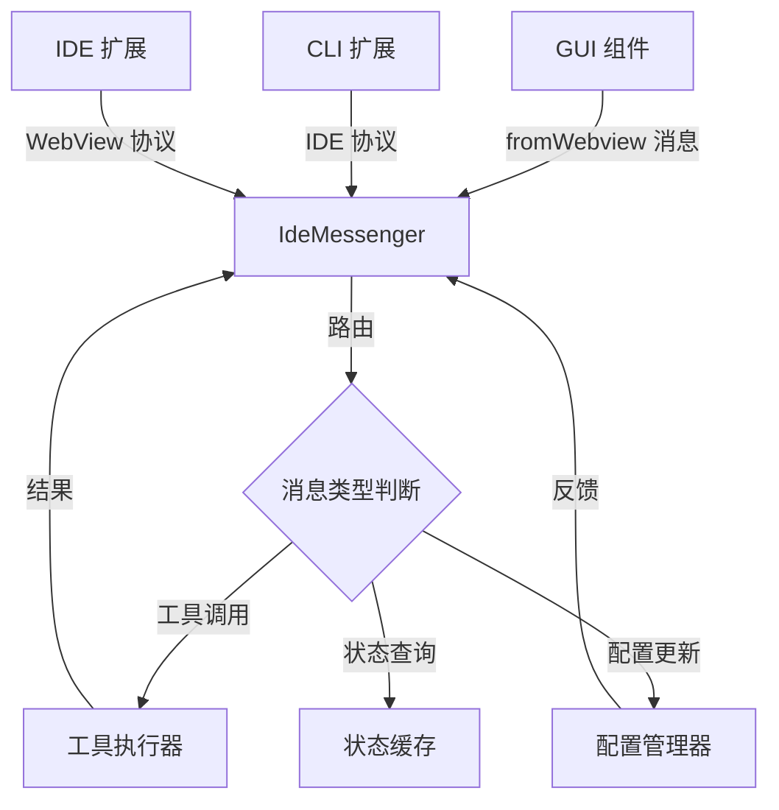

IdeMessenger 的核心职责：

1. **消息序列化与反序列化**：将 TypeScript 对象转换为可传输的协议格式
2. **路由分发**：根据消息类型将请求分发到对应的处理器
3. **响应管理**：维护请求-响应映射，支持异步消息回调
4. **错误处理**：统一处理通信过程中的异常情况

资料来源：[core/protocol/messenger/index.ts:1-150]()

### IPC 通信层

`IpcMessenger` 运行在二进制层，负责底层进程间通信的实现。该类封装了操作系统级别的 IPC 机制，提供了可靠的消息传输通道。


IpcMessenger 支持的传输机制：

| 传输方式 | 适用场景 | 特性 |
|---------|---------|------|
| 标准输入/输出 | 父子进程通信 | 简单可靠，适合单向流 |
| 命名管道 | 跨进程实时通信 | 低延迟，支持双向流 |
| Unix 套接字 | 高并发场景 | 性能最优，支持多客户端 |

资料来源：[binary/src/IpcMessenger.ts:1-100]()

## 消息类型系统

### 工具调用消息

工具调用是消息传递系统最重要的应用场景之一。当用户触发代码编辑、文件操作等请求时，消息系统负责将这些请求传递到对应的处理模块。

```typescript
// 工具调用消息结构
interface ToolCallMessage {
  id: string;
  tool: "Read" | "Edit" | "Write" | "Bash" | ...;
  params: Record<string, unknown>;
  context?: ContextItem[];
}
```

消息流程：

1. GUI 层通过 `ideMessenger.post("toolCall", toolCallMessage)` 发送请求
2. 核心层接收消息并分发到工具执行器
3. 执行器调用相应 IDE 协议方法
4. 执行结果通过 `toWebview` 消息返回前端

### 配置管理消息

配置变更需要实时同步到所有相关模块。消息系统处理配置文件的读取、验证和热更新。

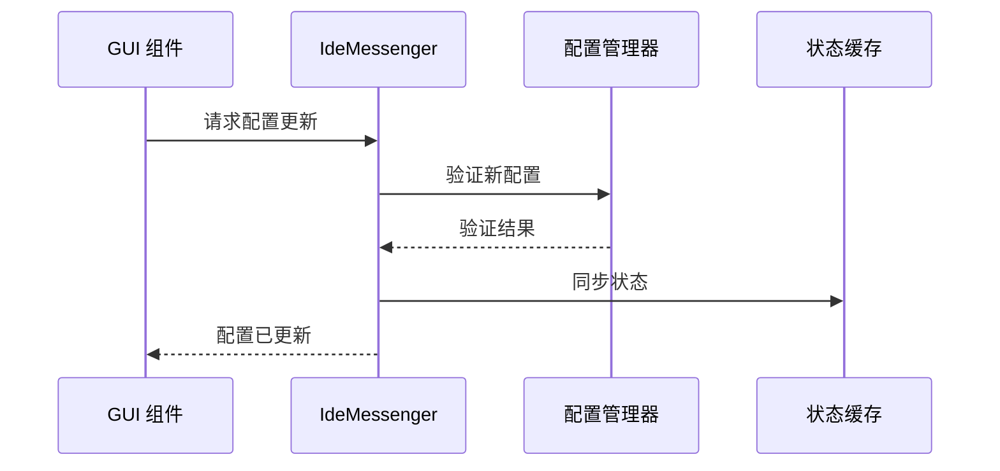

### 上下文传递消息

在代码补全和分析场景中，需要将当前编辑器状态、选中代码等上下文信息传递给模型。上下文消息的序列化采用高效二进制格式以减少传输开销。

## 错误处理与重试

消息传递系统实现了完整的错误处理机制：

| 错误类型 | 处理策略 | 重试机制 |
|---------|---------|---------|
| 传输超时 | 返回错误响应 | 自动重试 3 次 |
| 序列化失败 | 记录日志并丢弃 | 不重试 |
| 目标不可达 | 缓存消息等待重连 | 后台队列重试 |
| 权限拒绝 | 返回权限错误 | 提示用户授权 |

## 性能优化

消息传递系统采用以下优化策略：

1. **批量处理**：合并高频小消息为批量请求
2. **流式传输**：大文件内容使用流式 API
3. **懒加载**：按需加载非关键协议模块
4. **缓存复用**：热点消息结果缓存避免重复处理

资料来源：[core/protocol/messenger/index.ts:80-150]()

## 扩展机制

第三方开发者可以通过以下方式扩展消息系统：

1. **自定义工具协议**：在 `core/protocol` 下添加新的协议定义文件
2. **消息中间件**：注册预处理/后处理钩子
3. **传输层适配器**：实现 `IpcAdapter` 接口支持新的传输方式

## 总结

Continue 的通信协议与消息传递系统采用分层架构设计，通过标准化的协议定义和统一的 `IdeMessenger` 路由层，实现了 GUI、CLI、IDE 扩展与核心逻辑之间的高效通信。IPC 层确保了跨进程场景下的可靠传输，而丰富的错误处理和性能优化机制保证了系统的稳定性与响应速度。

---

<a id='llm-integration'></a>

## LLM集成架构

### 相关页面

相关主题：[模型提供商支持](#model-providers), [系统架构设计](#system-architecture)

<details>
<summary>相关源码文件</summary>

以下源码文件用于生成本页说明：

- [gui/src/pages/config/sections/ModelsSection.tsx](https://github.com/continuedev/continue/blob/main/gui/src/pages/config/sections/ModelsSection.tsx)
- [gui/src/components/modelSelection/ModelCard.tsx](https://github.com/continuedev/continue/blob/main/gui/src/components/modelSelection/ModelCard.tsx)
- [extensions/cli/src/systemMessage.ts](https://github.com/continuedev/continue/blob/main/extensions/cli/src/systemMessage.ts)
- [extensions/cli/src/ui/IntroMessage.tsx](https://github.com/continuedev/continue/blob/main/extensions/cli/src/ui/IntroMessage.tsx)
- [gui/src/components/console/Details.tsx](https://github.com/continuedev/continue/blob/main/gui/src/components/console/Details.tsx)
- [gui/src/pages/stats.tsx](https://github.com/continuedev/continue/blob/main/gui/src/pages/stats.tsx)
</details>

# LLM集成架构

Continue 是一个开源的 AI 编程助手，其核心功能之一是通过模块化的 LLM 集成架构实现与多种大语言模型的无缝对接。本页面详细说明 Continue 项目中 LLM 集成的整体架构、核心组件、配置管理以及运行时交互机制。

## 1. 架构概述

Continue 的 LLM 集成架构采用分层设计，将模型调用、消息处理、流式输出和工具支持解耦为独立模块。这种设计使得系统能够支持多种 LLM 提供商（如 OpenAI、Anthropic、Local 模型等），同时保持核心逻辑的一致性。

### 1.1 核心设计原则

| 设计原则 | 说明 |
|---------|------|
| **抽象层隔离** | 通过统一的接口抽象不同 LLM 提供商的差异 |
| **配置驱动** | 模型选择和参数通过配置文件动态管理 |
| **流式优先** | 支持流式输出以提供实时响应体验 |
| **工具集成** | 原生支持 Function Calling 和 Tool Use |

资料来源：[extensions/cli/src/systemMessage.ts](https://github.com/continuedev/continue/blob/main/extensions/cli/src/systemMessage.ts)

### 1.2 架构分层图

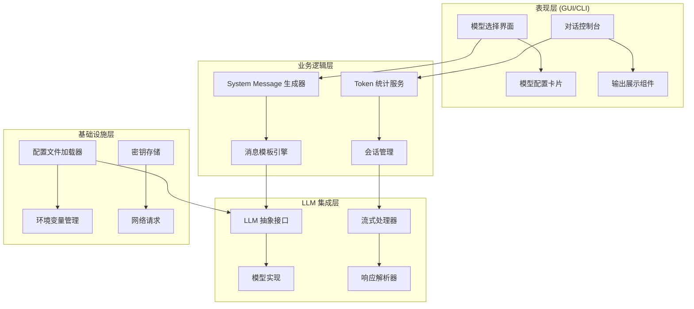

## 2. 模型配置与选择

### 2.1 模型角色体系

Continue 将 LLM 按照功能角色进行分类，每种角色承担特定的 AI 任务：

| 角色 | 功能描述 | 使用场景 |
|------|---------|---------|
| **chat** | 对话模型 | 聊天交互、问题回答 |
| **autocomplete** | 代码补全 | 实时代码补全建议 |
| **edit** | 代码编辑 | 代码转换和修改 |

资料来源：[gui/src/pages/config/sections/ModelsSection.tsx](https://github.com/continuedev/continue/blob/main/gui/src/pages/config/sections/ModelsSection.tsx)

### 2.2 模型卡片组件

`ModelCard` 组件负责渲染单个模型的配置卡片，包含以下关键信息：

```typescript
interface ModelCardProps {
  title: string;           // 模型显示名称
  description: string;     // 模型描述
  icon?: string;           // 模型图标路径
  tags?: string[];         // 模型特性标签
  dimensions?: Dimension[];  // 可配置参数维度
  providerOptions?: Option[]; // 提供商选项
  refUrl?: string;         // 文档链接
}
```

资料来源：[gui/src/components/modelSelection/ModelCard.tsx](https://github.com/continuedev/continue/blob/main/gui/src/components/modelSelection/ModelCard.tsx)

### 2.3 模型选择流程图

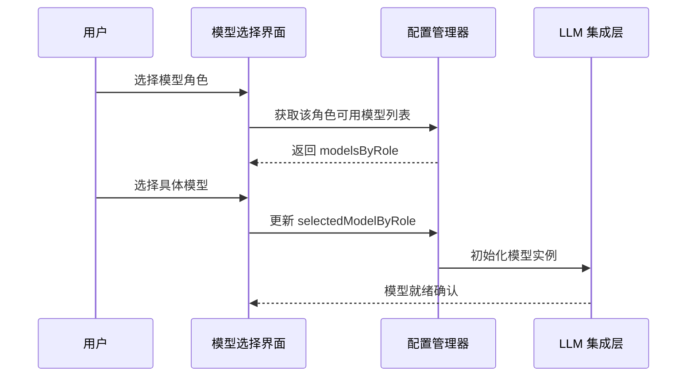

## 3. System Message 生成机制

### 3.1 概述

`systemMessage.ts` 是 LLM 集成架构中的核心模块，负责为每次 LLM 请求生成系统提示词（System Prompt）。它根据运行模式、用户配置和规则动态组装系统消息内容。

资料来源：[extensions/cli/src/systemMessage.ts](https://github.com/continuedev/continue/blob/main/extensions/cli/src/systemMessage.ts)

### 3.2 系统消息组装逻辑

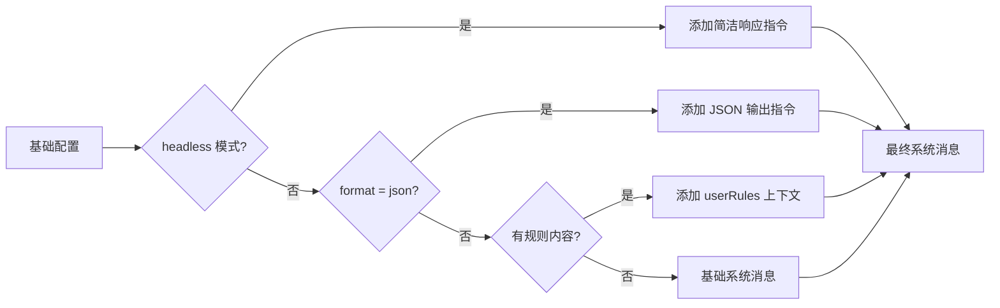

### 3.3 运行模式差异

| 模式 | 说明 | 系统消息特点 |
|------|------|-------------|
| **GUI 模式** | 图形界面交互 | 包含完整上下文和规则 |
| **Headless 模式** | 命令行无界面 | 仅返回最终答案，无解释 |
| **JSON 模式** | 结构化输出 | 强制返回有效 JSON |

## 4. 对话与输出管理

### 4.1 IntroMessage 组件

`IntroMessage` 组件负责在 CLI 界面中展示当前会话的基本信息，包括：

- **配置名称**：当前使用的配置集名称
- **模型信息**：选定的模型名称（显示为不带前缀的简称）
- **模型能力**：检查模型是否支持必要功能

```typescript
// 模型名称提取逻辑
<Text color="white">{model.name.split("/").pop()}</Text>
```

资料来源：[extensions/cli/src/ui/IntroMessage.tsx](https://github.com/continuedev/continue/blob/main/extensions/cli/src/ui/IntroMessage.tsx)

### 4.2 会话详情组件

`Details` 组件展示对话交互的统计信息和结果内容：

```typescript
interface InteractionDetails {
  summary: {
    tokensPerSecond: number;  // Token 处理速度
    totalTime: number;        // 总耗时
    costBreakdown?: {         // 成本明细
      breakdown: string;
    };
  };
  interaction: {
    start?: StartItem;        // 起始标记
    results: ResultGroup[];   // 结果组
    end?: EndItem;            // 结束标记
  };
}
```

资料来源：[gui/src/components/console/Details.tsx](https://github.com/continuedev/continue/blob/main/gui/src/components/console/Details.tsx)

### 4.3 输出展示流程

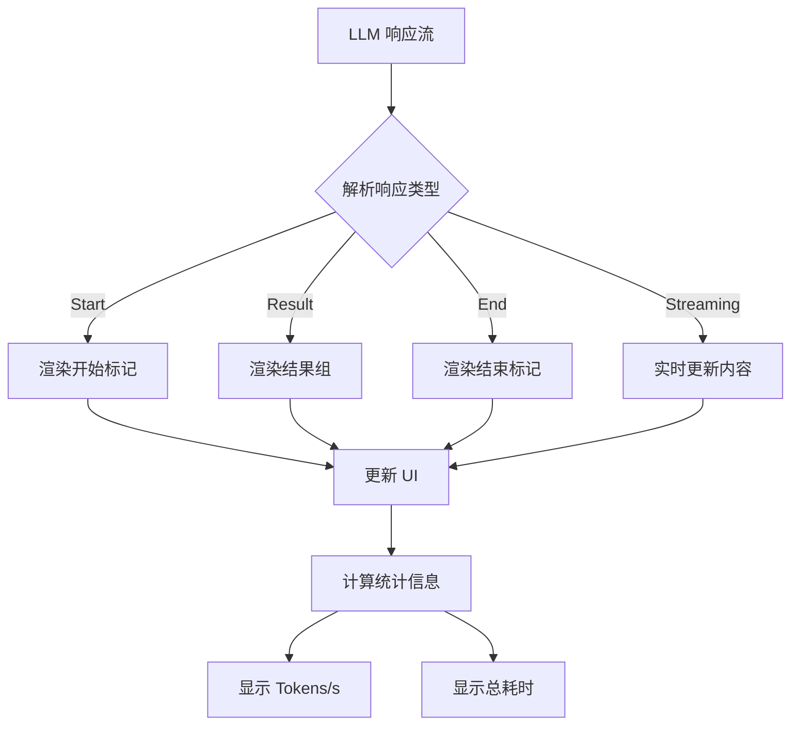

## 5. Token 统计与监控

### 5.1 统计页面架构

`stats.tsx` 提供每日和按模型的 Token 使用统计：

| 统计维度 | 数据字段 |
|---------|---------|
| **每日统计** | day, generatedTokens, promptTokens |
| **按模型统计** | model, generatedTokens, promptTokens |

资料来源：[gui/src/pages/stats.tsx](https://github.com/continuedev/continue/blob/main/gui/src/pages/stats.tsx)

### 5.2 资源监控数据模型

```typescript
interface ResourceSummary {
  peak: {
    memory: number;  // 峰值内存使用
    cpu: number;     // 峰值 CPU 使用率
  };
  average: {
    memory: number;  // 平均内存使用
    cpu: number;     // 平均 CPU 使用率
  };
}
```

资料来源：[extensions/cli/src/ui/components/ResourceDebugBar.tsx](https://github.com/continuedev/continue/blob/main/extensions/cli/src/ui/components/ResourceDebugBar.tsx)

## 6. 配置管理与错误处理

### 6.1 致命错误通知

当 LLM 配置加载失败时，系统通过 `FatalErrorNotice` 组件展示错误信息：

```typescript
interface FatalErrorProps {
  error: Error | undefined;
  configLoading: boolean;
  currentPath: CONFIG_ROUTES;
}
```

错误处理流程：
1. 检测配置加载状态
2. 识别错误类型（模型不可用/配置格式错误）
3. 显示用户友好的错误提示
4. 提供"重新加载"和"查看配置"操作

资料来源：[gui/src/components/config/FatalErrorNotice.tsx](https://github.com/continuedev/continue/blob/main/gui/src/components/config/FatalErrorNotice.tsx)

### 6.2 配置加载状态图

```mermaid
stateDiagram-v2
    [*] --> Loading: 初始化
    Loading --> Success: 配置加载完成
    Loading --> Error: 加载失败
    Success --> Reloading: 用户点击重新加载
    Reloading --> Success: 重新加载成功
    Reloading --> Error: 重新加载失败
    Error --> Loading: 用户点击重新加载
```

## 7. 关键技术特性

### 7.1 多提供商支持

Continue 通过统一的抽象接口支持多种 LLM 提供商：

- **云端模型**：OpenAI GPT 系列、Anthropic Claude 系列
- **本地模型**：Ollama、LM Studio 等本地部署方案
- **自定义端点**：支持 OpenAI 兼容 API

### 7.2 工具调用集成

系统支持 Function Calling 功能，使 LLM 能够调用预定义的工具函数：

```typescript
// 工具调用上下文格式
<context name="tools">
[{"name": "toolName", "description": "...", "parameters": {...}}]
</context>
```

### 7.3 提交签名集成

在 Git 操作中自动添加提交签名信息：

```typescript
<context name="commitSignature">
Generated with [Continue](https://continue.dev)
Co-Authored-By: Continue <noreply@continue.dev>
</context>
```

资料来源：[extensions/cli/src/systemMessage.ts](https://github.com/continuedev/continue/blob/main/extensions/cli/src/systemMessage.ts)

## 8. 总结

Continue 的 LLM 集成架构通过分层设计实现了高度的灵活性和可扩展性。核心设计包括：

| 层面 | 职责 | 关键文件 |
|------|------|---------|
| 表现层 | 用户交互与展示 | ModelCard, Details, IntroMessage |
| 配置层 | 模型配置管理 | ModelsSection, FatalErrorNotice |
| 消息层 | System Prompt 生成 | systemMessage.ts |
| 统计层 | 使用量与性能监控 | stats.tsx, ResourceDebugBar |

该架构使得 Continue 能够无缝集成多种 LLM 提供商，同时保持一致的用户体验和开发接口。

---

<a id='model-providers'></a>

## 模型提供商支持

### 相关页面

相关主题：[LLM集成架构](#llm-integration)

<details>
<summary>相关源码文件</summary>

以下源码文件用于生成本页说明：

- [core/llm/llms/index.ts](https://github.com/continuedev/continue/blob/main/core/llm/llms/index.ts)
- [core/llm/llms/OpenAI.ts](https://github.com/continuedev/continue/blob/main/core/llm/llms/OpenAI.ts)
- [core/llm/llms/Anthropic.ts](https://github.com/continuedev/continue/blob/main/core/llm/llms/Anthropic.ts)
- [core/llm/llms/Ollama.ts](https://github.com/continuedev/continue/blob/main/core/llm/llms/Ollama.ts)
- [packages/openai-adapters/src/apis/OpenAI.ts](https://github.com/continuedev/continue/blob/main/packages/openai-adapters/src/apis/OpenAI.ts)
- [gui/src/components/modelSelection/ModelCard.tsx](https://github.com/continuedev/continue/blob/main/gui/src/components/modelSelection/ModelCard.tsx)
- [gui/src/pages/config/sections/ModelsSection.tsx](https://github.com/continuedev/continue/blob/main/gui/src/pages/config/sections/ModelsSection.tsx)
- [extensions/cli/src/slashCommands.ts](https://github.com/continuedev/continue/blob/main/extensions/cli/src/slashCommands.ts)
</details>

# 模型提供商支持

## 概述

Continue 是一款开源的 AI 编程助手，支持多种大语言模型（LLM）提供商。通过统一的抽象层，Continue 能够集成 OpenAI、Anthropic、Ollama 等主流模型服务，同时保持配置的一致性和扩展性。模型提供商支持是 Continue 的核心功能之一，使用户能够灵活选择最适合其工作流程的 AI 模型。

模型配置系统采用角色分离架构，将模型按用途分为**聊天（Chat）**、**自动补全（Autocomplete）** 和**编辑（Edit）** 三种角色，每种角色可以独立配置不同的提供商和模型实例。这种设计允许开发者在不同场景下使用最合适的模型，例如使用高性能模型进行复杂代码审查，使用轻量级模型进行代码补全以降低延迟和成本。

## 架构设计

### 核心模块结构

Continue 的模型支持系统采用分层架构，从底层到上层依次为：

1. **适配器层（Adapter Layer）**：处理不同 API 提供商的协议差异，将请求标准化
2. **模型实现层（Model Implementation Layer）**：封装各提供商的 SDK 和 API 调用逻辑
3. **模型工厂层（Model Factory Layer）**：根据配置动态创建模型实例
4. **配置管理层（Configuration Layer）**：管理模型配置、凭证和环境变量

```mermaid
graph TD
    A[用户配置] --> B[Config Models]
    B --> C[Model Factory]
    C --> D{Provider Type}
    D -->|OpenAI| E[OpenAI Adapter]
    D -->|Anthropic| F[Anthropic Adapter]
    D -->|Ollama| G[Ollama Adapter]
    E --> H[统一 LLM 接口]
    F --> H
    G --> H
    H --> I[Continue Core]
```

### 适配器模式

Continue 大量使用适配器模式来处理不同 API 提供商之间的差异。核心适配器接口定义了统一的请求和响应格式，各提供商适配器负责将标准化请求转换为特定 API 的格式。这种设计使得添加新的模型提供商变得简单，只需实现相应的适配器接口即可，无需修改上层业务逻辑。

```mermaid
classDiagram
    class LLMAdapter {
        <<interface>>
        +complete(): Promise~Completion~
        +chat(): Promise~ChatResponse~
        +stream(): AsyncIterator~StreamChunk~
    }
    
    class OpenAIAdapter {
        +apiKey: string
        +baseUrl: string
        +complete()
        +chat()
    }
    
    class AnthropicAdapter {
        +apiKey: string
        +complete()
        +chat()
    }
    
    class OllamaAdapter {
        +baseUrl: string
        +complete()
        +chat()
    }
    
    LLMAdapter <|.. OpenAIAdapter
    LLMAdapter <|.. AnthropicAdapter
    LLMAdapter <|.. OllamaAdapter
```

## 支持的模型提供商

### 提供商类型对比

| 提供商 | API 类型 | 本地部署 | 流式响应 | 多模态支持 | 配置复杂度 |
|--------|----------|----------|----------|------------|------------|
| OpenAI | REST | ❌ | ✅ | ✅ | 低 |
| Anthropic | REST | ❌ | ✅ | ✅ | 低 |
| Ollama | REST | ✅ | ✅ | ✅ | 中 |
| Azure OpenAI | REST | ❌ | ✅ | ✅ | 高 |
| 本地模型 | 多种 | ✅ | 视实现 | 视模型 | 高 |

### OpenAI 支持

OpenAI 是 Continue 默认且最广泛支持的模型提供商。通过 `packages/openai-adapters/src/apis/OpenAI.ts` 中的适配器实现，Continue 支持 OpenAI 全系列模型，包括 GPT-4、GPT-4 Turbo、GPT-3.5 Turbo 等。

OpenAI 适配器的核心功能包括：

- **基础 URL 配置**：支持标准 OpenAI API 端点和自定义代理
- **API 密钥管理**：通过环境变量或配置文件安全存储
- **组织标识**：支持多组织账户的计费归属
- **请求超时控制**：可配置的请求超时和重试机制
- **Token 计数**：内置 token 用量统计和成本估算

配置 OpenAI 模型需要提供以下参数：

```yaml
models:
  - name: gpt-4
    provider: openai
    api_key: ${OPENAI_API_KEY}
    api_base: https://api.openai.com/v1
```

### Anthropic 支持

Anthropic 提供的 Claude 系列模型以其长上下文窗口和强大的推理能力著称。Continue 通过专门的适配器模块 `core/llm/llms/Anthropic.ts` 实现对 Claude 模型的支持。

Anthropic 模型的主要特点：

- **超长上下文**：支持高达 200K token 的上下文窗口
- **工具使用**：原生支持函数调用和工具使用能力
- **系统提示优化**：针对系统消息有专门的优化处理
- **安全过滤**：内置内容安全过滤机制

Anthropic 适配器实现的核心接口与 OpenAI 类似，但针对 Claude 的 API 规范进行了适配。关键差异包括消息格式的转换、停止序列的处理方式，以及流式响应的解析逻辑。

### Ollama 本地部署支持

Ollama 是一个开源的本地模型运行框架，Continue 通过 `core/llm/llms/Ollama.ts` 提供完整支持。Ollama 支持使用户能够在本地机器上运行各种开源模型，如 Llama 2、Mistral、Codellama 等，无需依赖云端 API。

Ollama 配置的优势：

- **隐私保护**：所有数据均在本地处理，不外传
- **成本降低**：无需支付 API 调用费用
- **离线可用**：无网络连接时仍可使用
- **自定义模型**：支持导入和微调自定义模型
- **低延迟**：本地推理通常具有更低的响应延迟

Ollama 适配器需要配置本地服务地址，默认情况下指向 `http://localhost:11434`。首次使用前需确保 Ollama 服务已在后台运行。

## 模型角色配置

### 角色定义

Continue 将模型使用场景分为三种角色，每种角色针对特定任务进行了优化：

| 角色 | 用途 | 延迟要求 | 成本考虑 | 推荐模型 |
|------|------|----------|----------|----------|
| Chat | 对话交互、代码解释、问答 | 中等 | 高 | GPT-4、Claude |
| Autocomplete | 实时代码补全 | 极低 | 低 | GPT-3.5 Turbo、Code Llama |
| Edit | 代码转换、重构、生成 | 低 | 中 | GPT-4、Claude |

### 角色配置界面

模型角色配置通过 `gui/src/pages/config/sections/ModelsSection.tsx` 组件实现用户界面。该组件提供直观的配置选项，允许用户：

1. **选择活跃模型**：为每个角色选择当前使用的模型
2. **查看模型信息**：显示模型名称、提供商、描述和标签
3. **配置模型参数**：调整温度、最大 token 等生成参数
4. **访问文档链接**：提供模型配置文档的快速访问

```typescript
// 角色配置数据结构
interface ModelRoleConfig {
  chat: ModelConfig[];
  autocomplete: ModelConfig[];
  edit: ModelConfig[];
}

// 模型配置项
interface ModelConfig {
  name: string;
  provider: ProviderType;
  apiKey?: string;
  apiBase?: string;
  model: string;
  temperature?: number;
  maxTokens?: number;
  contextLength?: number;
}
```

### 角色特定配置项

不同角色支持不同的配置参数，这些参数影响模型的生成行为：

**聊天角色（Chat）**

| 参数 | 类型 | 默认值 | 说明 |
|------|------|--------|------|
| temperature | number | 0.7 | 生成随机性控制 |
| maxTokens | number | 4096 | 最大输出 token 数 |
| contextLength | number | 16384 | 上下文窗口大小 |
| presencePenalty | number | 0 | 话题新鲜度惩罚 |
| frequencyPenalty | number | 0 | 重复 token 惩罚 |

**自动补全角色（Autocomplete）**

| 参数 | 类型 | 默认值 | 说明 |
|------|------|--------|------|
| temperature | number | 0.5 | 较低以保持一致性 |
| maxTokens | number | 256 | 补全长度限制 |
| n | number | 1 | 候选补全数量 |
| stop | string[] | [] | 停止序列 |

**编辑角色（Edit）**

| 参数 | 类型 | 默认值 | 说明 |
|------|------|------|------|
| temperature | number | 0.3 | 低温度保持精确 |
| maxTokens | number | 2048 | 编辑建议长度 |
| diffFormat | boolean | true | 是否返回 diff 格式 |

## 模型选择交互

### 斜杠命令

用户可以通过斜杠命令快速切换模型。`extensions/cli/src/slashCommands.ts` 文件中定义了 `/model` 命令，该命令打开模型选择器界面。

```typescript
// slashCommands.ts 中的模型命令定义
const slashCommandHandlers = {
  model: () => ({ openModelSelector: true }),
  // ... 其他命令
};
```

支持的相关命令：

| 命令 | 功能 | 快捷键 |
|------|------|--------|
| `/model` | 打开模型选择器 | - |
| `/config` | 打开配置选择器 | - |
| `/whoami` | 显示当前配置和模型信息 | - |
| `/info` | 显示详细模型和系统信息 | - |

### 模型选择器界面

模型选择器由 `gui/src/components/modelSelection/ModelCard.tsx` 组件实现。该组件展示可用模型的详细信息，包括：

- **模型图标**：根据提供商显示对应的品牌图标
- **模型名称**：包含提供商前缀，如 `openai/gpt-4`
- **模型描述**：简要说明模型的适用场景
- **评估维度**：可选的能力评估指标，如代码生成、数学推理等
- **文档链接**：指向官方文档的链接
- **配置标签**：如免费、API 密钥要求等

```mermaid
graph LR
    A[用户输入 /model] --> B[打开模型选择器]
    B --> C[显示所有可用模型]
    C --> D{用户选择}
    D -->|标准模型| E[验证 API 密钥]
    D -->|本地模型| F[验证 Ollama 连接]
    E --> G[更新配置]
    F --> G
    G --> H[刷新界面显示]
```

## 模型信息展示

### 启动消息

`gui/src/components/StyledMarkdownPreview/IntroMessage.tsx` 组件在会话启动时显示当前模型配置信息。该组件展示：

- **配置名称**：当前使用的配置集名称
- **模型名称**：显示当前活跃模型的简称
- **加载状态**：模型信息未加载时显示加载指示器

```tsx
// 模型信息展示逻辑
{model ? (
  <Text color="blue">
    <Text bold>Model:</Text>{" "}
    <Text color="white">{model.name.split("/").pop()}</Text>
  </Text>
) : (
  <Text color="blue">
    <Text bold>Model:</Text> <Text color="dim">Loading...</Text>
  </Text>
)}
```

### 模型能力警告

当选定的模型可能不具备特定任务所需的能力时，系统会显示警告信息。这通过 `ModelCapabilityWarning` 组件实现，提示用户可能需要切换到更强大的模型。

### 使用统计

`gui/src/pages/stats.tsx` 页面提供 Token 使用统计，帮助用户了解不同模型的使用情况：

- **按日期统计**：每日 Prompt Token 和 Generated Token 数量
- **按模型统计**：各模型的使用量和占比
- **成本估算**：基于提供商定价的费用估算

| 统计维度 | 显示内容 | 数据来源 |
|----------|----------|----------|
| 日 Token 使用 | 当日生成和消费的 token 总数 | 本地存储 |
| 模型 Token 使用 | 各模型的独立使用统计 | 本地存储 |
| 成本估算 | 基于配置价格的预估费用 | 配置信息 |

## 配置管理

### 配置文件结构

模型提供商配置通常在 `config.json` 或 `~/.continue/config.json` 中定义：

```json
{
  "models": [
    {
      "title": "GPT-4",
      "provider": "openai",
      "model": "gpt-4",
      "apiKey": "${OPENAI_API_KEY}"
    },
    {
      "title": "Claude",
      "provider": "anthropic",
      "model": "claude-3-opus-20240229",
      "apiKey": "${ANTHROPIC_API_KEY}"
    },
    {
      "title": "Local Llama",
      "provider": "ollama",
      "model": "llama2",
      "apiBase": "http://localhost:11434"
    }
  ],
  "modelRoles": {
    "chat": "GPT-4",
    "autocomplete": "Local Llama",
    "edit": "Claude"
  }
}
```

### 环境变量支持

敏感信息如 API 密钥通过环境变量引用，避免硬编码在配置文件中：

| 变量名 | 用途 | 示例值 |
|--------|------|--------|
| OPENAI_API_KEY | OpenAI API 密钥 | sk-... |
| ANTHROPIC_API_KEY | Anthropic API 密钥 | sk-ant-... |
| OLLAMA_BASE_URL | Ollama 服务地址 | http://localhost:11434 |

### 配置验证

系统启动时执行配置验证，包括：

1. **API 连接测试**：验证模型提供商的可达性
2. **凭证有效性**：检查 API 密钥是否有效
3. **模型可用性**：确认指定模型是否在账户中可用
4. **参数合法性**：验证配置参数是否在有效范围内

验证失败时，`gui/src/components/config/FatalErrorNotice.tsx` 组件显示错误通知：

```tsx
// 错误通知逻辑
<Alert type="error" className="mx-2 my-1 px-2">
  <span>{`Error loading`}</span>{" "}
  <span className="italic">{displayName}</span>
  {". "}
  <span>{`Chat is disabled until a model is available.`}</span>
</Alert>
```

## 系统消息集成

`extensions/cli/src/systemMessage.ts` 文件负责生成发送给模型的系统消息，其中包含与模型相关的配置信息：

### 凭证注入

当检测到特定环境变量时，系统会在系统消息中注入上下文信息：

```typescript
// 凭证上下文注入逻辑
if (!process.env.CONTINUE_DISABLE_COMMIT_SIGNATURE) {
  systemMessage += `\n<context name="commitSignature">
Generated with [Continue](https://continue.dev)

Co-Authored-By: Continue <noreply@continue.dev>
</context>\n`;
}
```

### 角色规则传递

模型角色相关的规则通过系统消息传递给 AI：

```typescript
// 规则上下文添加
if (agentContent || processedRules.length > 0) {
  systemMessage += '\n\n<context name="userRules">';
  
  if (agentContent) {
    systemMessage += `\n${agentContent}`;
  }
  
  if (processedRules.length > 0) {
    const separator = agentContent ? "\n" : "";
    systemMessage += `${separator}${processedRules.join("\n")}`;
  }
  
  systemMessage += '</context>';
}
```

## 错误处理与恢复

### 模型不可用处理

当配置加载失败或模型不可用时，系统采取以下策略：

1. **显示错误通知**：通过 `FatalErrorNotice` 组件显示问题描述
2. **提供操作选项**：重试加载、查看配置或访问帮助文档
3. **禁用聊天功能**：防止用户尝试使用未初始化的模型
4. **记录错误日志**：便于问题诊断和调试

### 连接重试机制

对于网络相关错误，系统实现指数退避重试策略：

```mermaid
graph TD
    A[请求发送] --> B{响应状态}
    B -->|成功| C[返回结果]
    B -->|网络错误| D[重试计数 < 3]
    B -->|认证错误| E[终止并报错]
    D -->|是| F[等待 2^n 秒]
    F --> A
    D -->|否| G[终止并报错]
```

### 模型能力降级

当首选模型不可用时，系统支持配置备用模型实现能力降级：

```yaml
models:
  - name: primary-gpt4
    provider: openai
    model: gpt-4
  - name: fallback-gpt35
    provider: openai
    model: gpt-3.5-turbo

modelRoles:
  chat: primary-gpt4
  # 当 primary 不可用时自动切换到 fallback
```

## 扩展开发指南

### 添加新提供商

要添加新的模型提供商，需要实现以下步骤：

1. **创建适配器**：在 `core/llm/llms/` 目录下创建新的适配器文件
2. **实现接口**：遵循 `LLMAdapter` 接口定义实现必要方法
3. **注册工厂**：在模型工厂中注册新提供商的创建逻辑
4. **配置支持**：在配置解析器中添加新提供商的配置验证

```typescript
// 新提供商适配器模板
export class CustomProviderAdapter implements LLMAdapter {
  constructor(config: CustomProviderConfig) {
    this.config = config;
  }
  
  async complete(prompt: string): Promise<Completion> {
    // 实现完成接口
  }
  
  async chat(messages: Message[]): Promise<ChatResponse> {
    // 实现聊天接口
  }
  
  async *stream(prompt: string): AsyncIterator<StreamChunk> {
    // 实现流式接口
  }
}
```

### 提供商配置验证

新增提供商时需要在配置验证模块中添加对应的验证逻辑：

| 验证项 | 检查内容 | 错误消息 |
|--------|----------|----------|
| API 端点 | URL 格式和可达性 | Invalid API base URL |
| API 密钥 | 格式和必需性 | API key is required |
| 模型名称 | 在提供商处的可用性 | Model not found |
| 参数范围 | 温度、最大 token 等 | Parameter out of range |

## 最佳实践

### 模型选择建议

根据不同场景推荐使用不同的模型配置：

**复杂代码审查和重构**

- 角色：Chat、Edit
- 推荐模型：GPT-4、Claude 3 Opus
- 理由：强大推理能力和上下文理解

**日常代码补全**

- 角色：Autocomplete
- 推荐模型：Code Llama、GPT-3.5 Turbo
- 理由：低延迟、低成本

**隐私敏感场景**

- 角色：全部
- 推荐模型：Ollama + Llama 2
- 理由：数据本地处理

### 性能优化

1. **使用流式响应**：提升用户体验 Perception
2. **合理设置上下文**：避免加载不必要的上下文
3. **配置合适的温度**：不同任务使用不同温度
4. **启用本地模型**：降低 API 依赖和网络延迟

### 安全建议

1. **使用环境变量**：避免在配置文件中硬编码密钥
2. **限制 API 权限**：使用最小必要范围的 API 密钥
3. **定期轮换密钥**：周期性更换 API 密钥
4. **监控使用量**：定期检查 Token 使用统计

## 总结

Continue 的模型提供商支持系统通过模块化架构和适配器模式，实现了多提供商的无缝集成。从 OpenAI、Anthropic 到本地部署的 Ollama，用户可以根据需求灵活选择最合适的 AI 模型。角色分离的配置设计使得不同场景下可以使用不同的模型优化，而完善的错误处理和恢复机制保证了系统的稳定性和可用性。

---

<a id='autocomplete-system'></a>

## 自动补全系统

### 相关页面

相关主题：[上下文提供者](#context-providers), [代码库索引系统](#codebase-indexing)

<details>
<summary>相关源码文件</summary>

以下源码文件用于生成本页说明：

- [gui/src/pages/config/sections/UserSettingsSection.tsx](https://github.com/continuedev/continue/blob/main/gui/src/pages/config/sections/UserSettingsSection.tsx)
- [gui/src/pages/config/sections/ModelsSection.tsx](https://github.com/continuedev/continue/blob/main/gui/src/pages/config/sections/ModelsSection.tsx)
- [packages/config-yaml/src/validation.ts](https://github.com/continuedev/continue/blob/main/packages/config-yaml/src/validation.ts)
- [extensions/cli/src/systemMessage.ts](https://github.com/continuedev/continue/blob/main/extensions/cli/src/systemMessage.ts)
- [gui/src/components/OnboardingCard/components/OnboardingLocalTab.tsx](https://github.com/continuedev/continue/blob/main/gui/src/components/OnboardingCard/components/OnboardingLocalTab.tsx)
</details>

# 自动补全系统

## 概述

自动补全系统（Autocomplete System）是 Continue 插件的核心功能之一，为用户在编写代码时提供实时的内联代码补全建议。该系统通过专用的补全模型（Completion Model）实现，能够在用户输入时智能预测并生成代码片段。

自动补全系统的主要特点包括：

- **实时流式输出**：支持逐 token 流式返回补全结果，提供即时反馈
- **多行补全支持**：可配置是否启用多行代码补全功能
- **上下文感知**：基于当前文件内容和检索到的相关上下文进行补全
- **灵活配置**：支持超时时间、防抖延迟等参数的自定义配置
- **模型验证**：自动检测并警告不适合补全任务的模型

## 系统架构

```
┌─────────────────────────────────────────────────────────────────┐
│                        自动补全系统架构                           │
├─────────────────────────────────────────────────────────────────┤
│                                                                 │
│  ┌─────────────┐    ┌──────────────┐    ┌─────────────────────┐ │
│  │   前端 UI   │───▶│ 用户设置面板 │───▶│ 补全模型配置        │ │
│  └─────────────┘    └──────────────┘    └─────────────────────┘ │
│                                                │                 │
│                                                ▼                 │
│  ┌─────────────────────────────────────────────────────────────┐│
│  │                    核心补全引擎                              ││
│  │  ┌─────────────┐  ┌──────────────┐  ┌────────────────────┐  ││
│  │  │ 模板处理    │─▶│ 上下文检索   │─▶│ 流式转换管道       │  ││
│  │  └─────────────┘  └──────────────┘  └────────────────────┘  ││
│  └─────────────────────────────────────────────────────────────┘│
│                                                │                 │
│                                                ▼                 │
│  ┌─────────────┐    ┌──────────────┐    ┌─────────────────────┐ │
│  │   模型验证  │◀───│ 配置验证     │◀───│ YAML 配置解析       │ │
│  └─────────────┘    └──────────────┘    └─────────────────────┘ │
│                                                                 │
└─────────────────────────────────────────────────────────────────┘
```

## 核心组件

### 补全模型配置

自动补全功能使用专用的补全模型。与聊天模型不同，补全模型需要特别优化以支持代码补全任务。

#### 模型角色配置

| 角色 | 用途 | 说明 |
|------|------|------|
| `chat` | 对话交互 | 用于用户与 AI 的对话交流 |
| `autocomplete` | 代码补全 | 专门用于内联代码补全 |
| `edit` | 代码转换 | 用于转换和编辑选定的代码片段 |

资料来源：[gui/src/pages/config/sections/ModelsSection.tsx:25-40]()

#### 模型选择限制

系统在配置验证阶段会对补全模型进行特殊检查，以下模型类型**不适合**用于代码补全：

- `claude`
- `mistral`
- `instruct`

除非模型名称包含 `deepseek`、`codestral` 或 `coder` 等关键字。

资料来源：[packages/config-yaml/src/validation.ts:40-55]()

```typescript
const nonAutocompleteModels = [
  "claude",
  "mistral",
  "instruct",
];

if (
  nonAutocompleteModels.some((m) => modelName.includes(m)) &&
  !modelName.includes("deepseek") &&
  !modelName.includes("codestral") &&
  !modelName.toLowerCase().includes("coder")
) {
  errors.push({
    fatal: false,
    message: `${model.model} is not trained for tab-autocomplete, and will result in low-quality suggestions.`,
  });
}
```

### 用户设置面板

自动补全系统提供丰富的用户配置选项，位于设置界面的 "Autocomplete" 配置区段。

#### 配置参数表

| 参数 | 类型 | 默认值 | 取值范围 | 说明 |
|------|------|--------|----------|------|
| `useAutocompleteMultilineCompletions` | select | `auto` | `auto` \| `always` \| `never` | 控制多行补全行为 |
| `modelTimeout` | number | - | 100-5000ms | 补全请求最大超时时间 |
| `debounceDelay` | number | - | 0-2500ms | 触发补全请求的防抖延迟 |
| `disableAutocompleteInFiles` | string | - | Glob 模式 | 禁用补全的文件匹配模式 |

资料来源：[gui/src/pages/config/sections/UserSettingsSection.tsx:1-70]()

#### 多行补全配置

多行补全支持三种模式：

1. **Auto（自动）**：系统根据上下文自动决定是否启用多行补全
2. **Always（始终）**：始终启用多行补全
3. **Never（从不）**：禁用多行补全，只生成单行建议

```tsx
<UserSetting
  type="select"
  title="Multiline Autocompletions"
  description="Controls multiline completions for autocomplete."
  value={useAutocompleteMultilineCompletions}
  onChange={(value) =>
    handleUpdate({
      useAutocompleteMultilineCompletions: value as "auto" | "always" | "never",
    })
  }
  options={[
    { label: "Auto", value: "auto" },
    { label: "Always", value: "always" },
    { label: "Never", value: "never" },
  ]}
/>
```

#### 文件禁用配置

用户可以通过 glob 模式指定禁用自动补全的文件：

- 多个模式之间用逗号分隔
- 示例：`**/*.(txt,md)` 禁用在所有 `.txt` 和 `.md` 文件中的补全
- 空字符串视为未配置，所有文件启用补全

```tsx
<UserSetting
  type="input"
  title="Disable autocomplete in files"
  description="List of comma-separated glob pattern to disable autocomplete in matching files."
  placeholder="**/*.(txt,md)"
  value={formDisableAutocomplete}
  onChange={setFormDisableAutocomplete}
  onSubmit={handleDisableAutocompleteSubmit}
  onCancel={cancelChangeDisableAutocomplete}
  isDirty={formDisableAutocomplete !== disableAutocompleteInFiles}
  isValid={formDisableAutocomplete.trim() !== ""}
/>
```

### 本地部署配置

对于使用本地模型的用户，设置界面提供了模型下载和配置功能。

#### 本地补全模型

| 模型用途 | 模型标识 | 说明 |
|----------|----------|------|
| Chat 对话 | `LOCAL_ONBOARDING_CHAT_MODEL` | 用于对话交互的本地模型 |
| 代码补全 | `LOCAL_ONBOARDING_FIM_MODEL` | 用于代码补全的 FIM（Fill-in-the-Middle）模型 |
| 向量嵌入 | `LOCAL_ONBOARDING_EMBEDDINGS_MODEL` | 用于语义检索的嵌入模型 |

资料来源：[gui/src/components/OnboardingCard/components/OnboardingLocalTab.tsx:15-35]()

```tsx
<OllamaModelDownload
  title="Download Autocomplete model"
  modelName={LOCAL_ONBOARDING_FIM_MODEL}
  hasDownloaded={hasDownloadedAutocompleteModel}
/>
```

## 配置验证

### 模型兼容性检查

系统通过 `packages/config-yaml/src/validation.ts` 中的验证逻辑确保用户配置的补全模型适合代码补全任务。

#### 验证流程

```mermaid
graph TD
    A[加载模型配置] --> B{检查模型名称}
    B -->|包含 claude/mistral/instruct| C{检查特殊关键字}
    C -->|包含 deepseek/codestral/coder| D[验证通过]
    C -->|不包含特殊关键字| E[生成警告信息]
    D --> F[完成验证]
    E --> F
    B -->|其他模型| D
```

#### 警告信息

当检测到不推荐的模型时，系统会生成以下格式的警告：

```json
{
  "fatal": false,
  "message": "{model} is not trained for tab-autocomplete, and will result in low-quality suggestions. See the docs to learn more about why: https://docs.continue.dev/features/tab-autocomplete#i-want-better-completions-should-i-use-gpt-4"
}
```

资料来源：[packages/config-yaml/src/validation.ts:47-54]()

## CLI 集成

### 系统消息生成

在 CLI 模式下运行的 Continue 会根据配置生成相应的系统消息，告知模型当前的功能状态。

#### 模型能力警告

当检测到模型可能不具备最佳补全能力时，CLI 会显示相应的警告信息：

```tsx
{model && !modelCapable && (
  <>
    <ModelCapabilityWarning
      modelName={model.name.split("/").pop() || model.name}
    />
    <Text> </Text>
  </>
)}
```

资料来源：[extensions/cli/src/ui/IntroMessage.tsx:30-40]()

#### 精简模式指令

在无头模式（headless mode）下运行 CLI 时，系统会添加特定指令要求模型只提供最终答案：

```typescript
if (headless) {
  systemMessage += `
IMPORTANT: You are running in headless mode. Provide ONLY your final answer to the user's question. Do not include explanations, reasoning, or additional commentary unless specifically requested. Be direct and concise.`;
}
```

资料来源：[extensions/cli/src/systemMessage.ts:50-55]()

## 技术实现细节

### 补全流程

```
用户输入 ──▶ 防抖计时器 ──▶ 上下文检索 ──▶ 模板填充 ──▶ 模型推理 ──▶ 流式输出 ──▶ UI 展示
     │                         │              │              │
     │                         ▼              ▼              ▼
     │                   [ContextRetrieval] [Template] [CompletionStreamer]
     │                         │              │              │
     ▼                         ▼              ▼              ▼
  防抖延迟              检索相关代码片段   构建提示词    实时流式返回
  (debounceDelay)
```

### 防抖机制

自动补全使用防抖机制来避免过于频繁的请求：

- **最小延迟**：`0ms`（立即触发）
- **最大延迟**：`2500ms`
- **默认行为**：用户停止输入后等待指定时间再触发补全请求

### 超时控制

每个补全请求都有独立的超时控制：

| 参数 | 值 | 说明 |
|------|-----|------|
| 最小超时 | 100ms | 最短等待时间 |
| 最大超时 | 5000ms | 最长等待时间 |
| 默认超时 | 未设置 | 由模型配置决定 |

## 错误处理

### 配置加载失败

当配置加载失败时，界面会显示错误提示，并提供以下操作：

| 操作 | 说明 |
|------|------|
| Help | 打开故障排除文档 |
| Reload | 重新加载配置 |
| View | 查看配置详情 |

资料来源：[gui/src/components/config/FatalErrorNotice.tsx:10-40]()

### 模型能力不足

系统会持续监测当前模型的补全能力，当模型不适合代码补全任务时：

1. 在设置界面显示警告图标
2. 在 CLI 界面显示 `ModelCapabilityWarning` 组件
3. 仍允许用户使用，但建议更换模型

## 配置示例

### 基础配置（config.yaml）

```yaml
models:
  - name: codellama
    provider: openai
    model: codellama-7b-instruct
    role: autocomplete  # 指定为补全模型
```

### 完整配置示例

```yaml
models:
  - name: codellama-13b
    provider: llama
    model: codellama-13b-instruct
    role: autocomplete

  - name: gpt-4
    provider: openai
    model: gpt-4
    role: chat

  - name: gpt-4
    provider: openai
    model: gpt-4
    role: edit

autocomplete:
  useMultilineCompletions: auto
  timeout: 3000
  debounceDelay: 500
  disableInFiles: "**/*.txt,**/test/**"
```

## 最佳实践

### 选择合适的补全模型

1. **优先选择专门的代码补全模型**，如：
   - CodeLLama
   - StarCoder
   - Deepseek Coder
   - Codestral

2. **避免使用通用对话模型**进行代码补全

3. **本地部署建议使用 FIM 模型**，以获得最佳的补全效果

### 性能优化

| 场景 | 建议配置 |
|------|----------|
| 低配置设备 | 增加 `debounceDelay` 至 1000-1500ms |
| 高延迟网络 | 增加 `modelTimeout` 至 3000-5000ms |
| 需要快速响应 | 减少 `debounceDelay` 至 200-500ms |

### 文件排除策略

使用 glob 模式排除不需要补全的文件：

- 纯文本文件：`**/*.txt`
- 文档文件：`**/*.md`
- 测试文件：`**/test/**`
- 生成文件：`**/*.generated.*`

## 相关文档

- [Tab Autocomplete 官方文档](https://docs.continue.dev/features/tab-autocomplete)
- [模型配置指南](https://docs.continue.dev/reference/config)
- [故障排除](https://docs.continue.dev/troubleshooting)

---

<a id='codebase-indexing'></a>

## 代码库索引系统

### 相关页面

相关主题：[上下文提供者](#context-providers), [自动补全系统](#autocomplete-system)

<details>
<summary>相关源码文件</summary>

以下源码文件用于生成本页说明：

- [gui/src/pages/config/sections/IndexingSettingsSection.tsx](https://github.com/continuedev/continue/blob/main/gui/src/pages/config/sections/IndexingSettingsSection.tsx)
- [gui/src/pages/config/features/indexing/IndexingProgress.tsx](https://github.com/continuedev/continue/blob/main/gui/src/pages/config/features/indexing/IndexingProgress.tsx)
- [gui/src/pages/config/features/indexing/IndexingProgressErrorText.tsx](https://github.com/continuedev/continue/blob/main/gui/src/pages/config/features/indexing/IndexingProgressErrorText.tsx)
- [gui/src/components/dialogs/AddDocsDialog.tsx](https://github.com/continuedev/continue/blob/main/gui/src/components/dialogs/AddDocsDialog.tsx)
- [sync/src/README.md](https://github.com/continuedev/continue/blob/main/sync/src/README.md)
</details>

# 代码库索引系统

## 概述

Continue 的代码库索引系统（Codebase Indexing System）是用于构建和维护代码库知识索引的核心组件。该系统已被标记为**已弃用（deprecated）**，官方推荐使用[代码库文档感知功能](https://docs.continue.dev/guides/codebase-documentation-awareness)替代。

索引系统的核心职责包括：

- 对代码库中的文件进行扫描和解析
- 构建代码片段的索引数据库
- 支持语义搜索和代码补全
- 管理索引的刷新和增量更新

资料来源：[gui/src/pages/config/sections/IndexingSettingsSection.tsx:1-45]()

## 系统架构

### 主要组件

索引系统由以下几个核心模块组成：

| 组件 | 文件路径 | 功能描述 |
|------|----------|----------|
| CodebaseIndexer | `core/indexing/CodebaseIndexer.ts` | 主索引器，协调整个索引流程 |
| CodeSnippetsIndex | `core/indexing/CodeSnippetsIndex.ts` | 代码片段索引管理 |
| LanceDbIndex | `core/indexing/LanceDbIndex.ts` | 基于 LanceDB 的向量索引实现 |
| ChunkCodebaseIndex | `core/indexing/chunk/ChunkCodebaseIndex.ts` | 分块处理的索引实现 |
| refreshIndex | `core/indexing/refreshIndex.ts` | 索引刷新逻辑 |

### 架构流程图

```mermaid
graph TD
    A[代码库文件] --> B[CodebaseIndexer]
    B --> C{文件类型判断}
    C -->|代码文件| D[ChunkCodebaseIndex]
    C -->|文档文件| E[CodeSnippetsIndex]
    D --> F[分块处理]
    F --> G[LanceDbIndex]
    E --> H[向量嵌入]
    H --> G
    G --> I[索引数据库]
```

## 用户界面组件

### 索引设置页面

`IndexingSettingsSection` 组件负责展示索引相关的配置选项。该组件从 Redux store 中读取配置状态，并提供启用/禁用索引的开关功能。

资料来源：[gui/src/pages/config/sections/IndexingSettingsSection.tsx:1-45]()

**核心配置项：**

| 配置项 | 类型 | 默认值 | 说明 |
|--------|------|--------|------|
| disableIndexing | boolean | false | 是否禁用索引功能 |

### 索引进度展示

索引进度通过以下组件进行展示：

- **IndexingProgress**：主进度条组件，显示当前索引任务的状态
- **IndexingProgressTitleText**：进度标题文本
- **IndexingProgressIndicator**：进度指示器
- **IndexingProgressSubtext**：进度说明文本
- **IndexingProgressErrorText**：错误信息展示

资料来源：[gui/src/pages/config/features/indexing/IndexingProgress.tsx:1-40]()
资料来源：[gui/src/pages/config/features/indexing/IndexingProgressErrorText.tsx:1-35]()

**支持的状态类型：**

```typescript
type IndexStatus = "loading" | "waiting" | "success" | "failed";
```

### 文档添加对话框

`AddDocsDialog` 组件用于添加外部文档到索引系统。用户可以指定文档标题和起始 URL。

资料来源：[gui/src/components/dialogs/AddDocsDialog.tsx:1-80]()

**表单字段：**

| 字段 | 类型 | 必填 | 说明 |
|------|------|------|------|
| Title | string | 是 | 文档标题，用于在 `@docs` 子菜单中显示 |
| Start URL | string | 是 | 文档起始 URL |

## 数据同步机制

### Merkle 树同步

索引缓存在本地文件系统中维护，使用 Merkle 树结构来跟踪已计算的哈希值：

```mermaid
graph TD
    A[索引缓存] --> B[全局缓存]
    A --> C[标签特定缓存]
    B --> D[~/.continue/index/.index_cache]
    C --> E[~/.continue/index/tags/&lt;dir&gt;/&lt;branch&gt;/&lt;provider_id&gt;/.index_cache]
    A --> F[反向标签映射]
    F --> G[~/.continue/index/rev_tags]
```

资料来源：[sync/src/README.md:1-35]()

**缓存文件结构：**

- `~/.continue/index/.index_cache`：包含所有已计算哈希的全局缓存
- `~/.continue/index/tags/<dir>/<branch>/<provider_id>/.index_cache`：标签特定的缓存
- `~/.continue/index/rev_tags`：从哈希到标签的映射，文件以哈希前两位字符为前缀

### sync 模块文件说明

| 文件 | 功能 |
|------|------|
| `lib.rs` | Python 绑定的顶层调用函数 |
| `sync/merkle.rs` | Merkle 树实现，用于构建和比较树结构 |
| `sync/mod.rs` | 主同步逻辑，处理标签的磁盘数据库维护 |

资料来源：[sync/src/README.md:35-50]()

## 配置状态管理

### Redux Store 结构

索引状态通过 Redux 进行管理，配置存储在 `state.config.config` 中：

```typescript
interface IndexingConfig {
  disableIndexing?: boolean;
  // ... 其他配置项
}
```

资料来源：[gui/src/pages/config/sections/IndexingSettingsSection.tsx:1-45]()

### 错误处理

错误信息通过 `FatalErrorNotice` 组件展示，该组件：

- 显示加载错误的具体描述
- 提供帮助文档链接（https://docs.continue.dev/troubleshooting）
- 支持重新加载配置
- 支持跳转到配置页面

资料来源：[gui/src/components/config/FatalErrorNotice.tsx:1-60]()

## 当前限制

根据 sync 模块的 README 文档，索引系统存在以下已知限制：

1. **仅支持本地文件**：目前无法处理 Continue 服务器与 IDE 或工作空间不在同一台机器上的情况（Remote SSH、WSL 或团队 Continue 服务器）

2. **全量重新计算**：目前不使用 stat 检查文件的最近更改，而是在每次 IDE 重新加载时重新计算整个 Merkle 树。这在 Continue 代码库上耗时约 0.2 秒，性能可接受但有优化空间

资料来源：[sync/src/README.md:50-60]()

## 替代方案

索引功能已被弃用，官方推荐的替代方案是**使代理感知代码库和文档**。相关文档请访问：

- [代码库文档感知指南](https://docs.continue.dev/guides/codebase-documentation-awareness)

## 相关文件索引

| 类别 | 文件路径 |
|------|----------|
| 配置组件 | `gui/src/pages/config/sections/IndexingSettingsSection.tsx` |
| 进度展示 | `gui/src/pages/config/features/indexing/IndexingProgress.tsx` |
| 错误展示 | `gui/src/pages/config/features/indexing/IndexingProgressErrorText.tsx` |
| 文档添加 | `gui/src/components/dialogs/AddDocsDialog.tsx` |
| 错误通知 | `gui/src/components/config/FatalErrorNotice.tsx` |
| 同步模块 | `sync/src/README.md` |

---

<a id='context-providers'></a>

## 上下文提供者

### 相关页面

相关主题：[代码库索引系统](#codebase-indexing), [系统架构设计](#system-architecture)

<details>
<summary>相关源码文件</summary>

以下源码文件用于生成本页说明：

- [core/context/providers/index.ts](https://github.com/continuedev/continue/blob/main/core/context/providers/index.ts)
- [core/context/providers/CodeContextProvider.ts](https://github.com/continuedev/continue/blob/main/core/context/providers/CodeContextProvider.ts)
- [core/context/providers/RepoMapContextProvider.ts](https://github.com/continuedev/continue/blob/main/core/context/providers/RepoMapContextProvider.ts)
- [core/context/providers/SearchContextProvider.ts](https://github.com/continuedev/continue/blob/main/core/context/providers/SearchContextProvider.ts)
- [core/context/mcp/MCPContextProvider.ts](https://github.com/continuedev/continue/blob/main/core/context/mcp/MCPContextProvider.ts)
</details>

# 上下文提供者

## 概述

上下文提供者（Context Provider）是 Continue 智能编程助手中的核心组件，负责为 AI 模型提供各类代码上下文信息。这些提供者使 AI 能够理解当前编辑的代码文件、项目结构、搜索结果等关键信息，从而提供更准确和相关的代码补全、建议和问题解答。

## 架构设计

### 核心接口

Continue 中的上下文提供者都遵循统一的设计模式，每个提供者需要实现以下核心方法：

| 方法 | 描述 |
|------|------|
| `getContextItems` | 获取该提供者管理的上下文项列表 |
| `load` | 加载或初始化提供者所需的数据 |
| `resolve` | 解析特定的上下文项 |

### 组件层次结构

```mermaid
graph TD
    A[上下文提供者系统] --> B[CodeContextProvider]
    A --> C[RepoMapContextProvider]
    A --> D[SearchContextProvider]
    A --> E[MCPContextProvider]
    
    B --> F[获取当前代码上下文]
    C --> G[获取代码库结构]
    D --> H[获取搜索结果]
    E --> I[获取MCP工具结果]
```

## 内置上下文提供者

### CodeContextProvider

**职责**：提供当前编辑文件的代码上下文信息。

`CodeContextProvider` 负责追踪用户当前正在编辑的文件，并提取相关的代码上下文。这包括：

- 当前光标位置的代码片段
- 打开文件的语法树信息
- 相关的函数和类定义

### RepoMapContextProvider

**职责**：提供整个代码仓库的结构信息。

该提供者通过构建代码仓库的映射图，使 AI 能够：

- 理解项目目录结构
- 识别模块之间的依赖关系
- 获取相关文件的位置信息

### SearchContextProvider

**职责**：提供代码搜索结果作为上下文。

当用户在项目中进行代码搜索时，`SearchContextProvider` 会：

- 捕获搜索查询和结果
- 提供匹配项的代码片段
- 支持正则表达式和普通文本搜索

### MCPContextProvider

**职责**：集成 MCP（Model Context Protocol）协议的上下文提供者。

MCP 是一种标准化的上下文协议，允许扩展额外的上下文来源。该提供者：

- 连接 MCP 服务器
- 获取 MCP 工具返回的结果
- 将外部工具输出转换为标准上下文格式

## 工作流程

```mermaid
sequenceDiagram
    participant User as 用户
    participant GUI as GUI组件
    participant Provider as 上下文提供者
    participant Core as 核心引擎
    
    User->>GUI: 编辑代码
    GUI->>Provider: 请求上下文
    Provider->>Provider: 加载/筛选数据
    Provider-->>GUI: 返回ContextItems
    GUI->>Core: 发送上下文
    Core-->>User: AI响应
```

## 上下文项数据结构

每个上下文提供者返回的上下文项（ContextItem）包含以下核心字段：

| 字段 | 类型 | 说明 |
|------|------|------|
| `id` | string | 唯一标识符 |
| `name` | string | 上下文项名称 |
| `description` | string | 简要描述 |
| `content` | string | 实际内容 |
| `uri` | URI | 资源定位符 |

## UI 集成

上下文提供者在 GUI 中通过 `ContextItemsPeek` 组件展示。该组件负责：

- 渲染上下文项的图标和名称
- 处理上下文项的点击事件
- 显示文件类型的相关标识

### 图标显示逻辑

```typescript
// 根据上下文项类型选择合适的图标
const shouldShowFileIcon =
  contextItem.content.includes("```") || 
  contextItem.uri?.type === "file";
```

## 配置与扩展

### 注册新的上下文提供者

开发者可以通过扩展 `core/context/providers/` 目录来添加自定义的上下文提供者：

1. 创建新的提供者类
2. 实现核心接口方法
3. 在 `index.ts` 中注册该提供者

### MCP 扩展

MCP 上下文提供者支持通过 MCP 服务器进行扩展，允许：

- 连接远程代码分析服务
- 集成第三方代码库文档
- 添加自定义的上下文来源

## 最佳实践

1. **按需加载**：上下文提供者应实现延迟加载，只在需要时才加载数据
2. **缓存机制**：对于频繁访问的上下文数据，实施适当的缓存策略
3. **错误处理**：提供优雅的错误处理和降级方案
4. **性能优化**：避免返回过大的上下文内容，优先返回最相关的信息

## 相关文件

| 文件路径 | 功能 |
|----------|------|
| `core/context/providers/index.ts` | 提供者注册与导出 |
| `core/context/providers/CodeContextProvider.ts` | 代码上下文实现 |
| `core/context/providers/RepoMapContextProvider.ts` | 仓库映射实现 |
| `core/context/providers/SearchContextProvider.ts` | 搜索上下文实现 |
| `core/context/mcp/MCPContextProvider.ts` | MCP 协议集成 |

## 总结

上下文提供者是 Continue 实现智能编程辅助的基础设施。通过模块化的设计，系统能够灵活地集成各种代码上下文来源，同时保持良好的可扩展性和维护性。开发者可以根据需要添加自定义的上下文提供者，以满足特定的代码分析或辅助需求。

---

<a id='vscode-extension'></a>

## VSCode扩展

### 相关页面

相关主题：[通信协议与消息传递](#communication-protocols)

<details>
<summary>相关源码文件</summary>

以下源码文件用于生成本页说明：

- [extensions/vscode/src/activation/activate.ts](https://github.com/continuedev/continue/blob/main/extensions/vscode/src/activation/activate.ts)
- [extensions/vscode/src/ContinueGUIWebviewViewProvider.ts](https://github.com/continuedev/continue/blob/main/extensions/vscode/src/ContinueGUIWebviewViewProvider.ts)
- [extensions/vscode/src/autocomplete/completionProvider.ts](https://github.com/continuedev/continue/blob/main/extensions/vscode/src/autocomplete/completionProvider.ts)
- [extensions/vscode/src/diff/vertical/handler.ts](https://github.com/continuedev/continue/blob/main/extensions/vscode/src/diff/vertical/handler.ts)
- [extensions/vscode/package.json](https://github.com/continuedev/continue/blob/main/extensions/vscode/package.json)
</details>

# VSCode扩展

## 概述

Continue 的 VSCode 扩展是该项目的核心前端组件，为开发者提供了一个集成化的 AI 辅助编程环境。该扩展通过 VSCode 的 Webview API 与核心后端逻辑通信，实现了代码补全、智能编辑、对话式交互等核心功能。

## 架构设计

### 整体架构

```
┌─────────────────────────────────────────────────────────────┐
│                      VSCode 主机进程                          │
│  ┌─────────────────────────────────────────────────────┐   │
│  │              ContinueGUIWebviewViewProvider          │   │
│  │                   (Webview 容器)                      │   │
│  │  ┌───────────────────────────────────────────────┐   │   │
│  │  │              React GUI 应用                    │   │   │
│  │  │  ┌─────────┐  ┌──────────┐  ┌─────────────┐   │   │   │
│  │  │  │ TipTap  │  │ Markdown │  │ StepContainer│   │   │   │
│  │  │  │ Editor  │  │ Preview  │  │              │   │   │   │
│  │  │  └─────────┘  └──────────┘  └─────────────┘   │   │   │
│  │  └───────────────────────────────────────────────┘   │   │
│  └─────────────────────────────────────────────────────┘   │
│                              │                               │
│  ┌─────────────────────────────────────────────────────┐   │
│  │           Autocomplete CompletionProvider           │   │
│  │                 (内联代码补全)                         │   │
│  └─────────────────────────────────────────────────────┘   │
│                              │                               │
│  ┌─────────────────────────────────────────────────────┐   │
│  │            Vertical Diff Handler                    │   │
│  │                 (代码差异处理)                         │   │
│  └─────────────────────────────────────────────────────┘   │
└─────────────────────────────────────────────────────────────┘
```

### 核心组件职责

| 组件名称 | 职责范围 | 主要功能 |
|---------|---------|---------|
| `activate.ts` | 扩展激活 | 初始化注册、事件监听设置 |
| `ContinueGUIWebviewViewProvider` | Webview 管理 | 面板视图、消息通信 |
| `completionProvider.ts` | 代码补全 | 内联补全、触发逻辑 |
| `vertical/handler.ts` | 差异处理 | 代码修改应用/撤销 |

## 激活机制

### 扩展激活流程

```mermaid
graph TD
    A[VSCode 加载扩展] --> B[调用 activate 函数]
    B --> C[注册 WebviewViewProvider]
    C --> D[注册命令处理器]
    D --> E[注册自动补全 Provider]
    E --> F[注册差异视图 Provider]
    F --> G[初始化完成,扩展就绪]
```

`activate.ts` 是扩展的入口点，负责协调所有子系统的初始化工作。扩展使用 `vscode.extensions.getExtension` 获取自身引用，并通过 `extendMarkdownIt` 注册自定义的 Markdown 处理扩展。

扩展支持多种激活事件，包括：

- `onLanguage:javascript` - JavaScript 文件打开时激活
- `onLanguage:typescript` - TypeScript 文件打开时激活
- `workspaceContains:**/*` - 工作区包含任意文件时激活

## Webview 视图提供者

### ContinueGUIWebviewViewProvider

`ContinueGUIWebviewViewProvider` 负责管理 Continue 主面板的 Webview 实例。该组件继承自 VSCode 的 `WebviewViewProvider` 接口，提供以下核心能力：

| 功能 | 描述 |
|------|------|
| HTML 注入 | 通过 `asWebviewUri` 转换资源路径 |
| 消息通信 | 双向消息通道用于前端与扩展通信 |
| 状态持久化 | 通过 `StatefulWebviewView` 保存视图状态 |
| 命令注册 | 绑定快捷键到具体操作函数 |

### 消息通信协议

Webview 与扩展之间通过 `postMessage` 和 `onDidReceiveMessages` 进行通信。常见消息类型包括：

```typescript
// 客户端到扩展
type ClientMessage = 
  | { type: "invokeCommand"; command: string; args?: any[] }
  | { type: "showTutorial"; }
  | { type: "focusEditor"; }
  | { type: "closeSidebar"; };

// 扩展到客户端
type ServerMessage =
  | { type: "onOpenUrl"; url: string }
  | { type: "updateAfterLoad"; state: any }
  | { type: "onNewSession"; };
```

资料来源：[extensions/vscode/src/ContinueGUIWebviewViewProvider.ts]()

## 代码自动补全

### CompletionProvider 实现

`completionProvider.ts` 实现了 VSCode 的 `InlineCompletionItemProvider` 接口，为编辑器提供 AI 驱动的内联代码补全功能。

```mermaid
graph LR
    A[用户输入] --> B{触发条件检查}
    B -->|延迟检测| C[等待无操作时间]
    C --> D[获取文档上下文]
    D --> E[调用补全 API]
    E --> F[返回 InlineCompletionList]
    F --> G[VSCode 渲染补全项]
```

### 补全配置参数

| 参数名 | 类型 | 默认值 | 说明 |
|--------|------|--------|------|
| `delayInMs` | `number` | 150 | 触发补全前的等待时间 |
| `maxPrefixLines` | `number` | 20 | 用于上下文的代码前缀行数 |
| `maxSuffixLines` | `number` | 20 | 用于上下文的代码后缀行数 |
| `multiline` | `boolean` | `true` | 是否启用多行补全 |

资料来源：[extensions/vscode/src/autocomplete/completionProvider.ts]()

## 差异视图处理

### Vertical Diff Handler

`vertical/handler.ts` 负责管理和展示代码修改的差异视图。当 AI 生成代码修改建议时，该处理器创建可交互的差异视图，支持用户接受或拒绝变更。

```mermaid
graph TD
    A[AI 生成代码修改] --> B[创建 Diff View]
    B --> C{用户操作}
    C -->|Accept| D[应用修改到文档]
    C -->|Reject| E[撤销差异视图]
    C -->|Partial| F[应用部分修改]
    D --> G[清理 Diff 状态]
    E --> G
    F --> G
```

### 差异操作类型

| 操作 | 快捷键 | 行为描述 |
|------|--------|----------|
| Accept Diff | `Cmd+Shift+Enter` | 接受所有待处理修改 |
| Reject Diff | `Cmd+Shift+Backspace` | 拒绝所有待处理修改 |
| Accept Top | `Alt+Cmd+Y` | 仅接受最顶层修改 |
| Reject Top | `Alt+Cmd+N` | 仅拒绝最顶层修改 |

资料来源：[extensions/vscode/src/diff/vertical/handler.ts]()

## 快捷键绑定

### 核心快捷键配置

在 `HelpSection.tsx` 中定义了完整的快捷键映射表，这些快捷键通过 VSCode 的 `keybindings.json` 或扩展包配置进行注册。

| 快捷键 | 功能 |
|--------|------|
| `Cmd '` | 切换选中的模型 |
| `Cmd I` | 编辑高亮代码 |
| `Cmd L` | 新建对话 / 新建对话并附带选中代码 |
| `Cmd Backspace` | 取消响应 |
| `Cmd Shift I` | 切换内联编辑焦点 |
| `Cmd Shift L` | 聚焦当前对话 |
| `Cmd Shift R` | 调试终端 |
| `Cmd Shift Enter` | 接受差异 |
| `Cmd Shift Backspace` | 拒绝差异 |

资料来源：[gui/src/pages/config/sections/HelpSection.tsx]()

## Markdown 渲染增强

### patchNestedMarkdown 机制

扩展对 Markdown 渲染进行了增强处理，特别是针对代码块嵌套场景。当 AI 输出包含代码块的 Markdown 时，`patchNestedMarkdown` 函数会将外层分隔符转换为波浪号 (`~~~`)，以避免解析冲突。

```typescript
// 转换示例
// 输入:
```markdown
# 示例
```javascript
console.log("test")
```
```

// 输出:
~~~markdown
# 示例
```javascript
console.log("test")
```
~~~
```

资料来源：[gui/src/components/StyledMarkdownPreview/utils/patchNestedMarkdown.ts]()

### Mermaid 图表支持

内置的 `MermaidBlock` 组件支持在 Markdown 中直接渲染 Mermaid 图表，并提供缩放控制功能：

```mermaid
graph TD
    A[解析 Mermaid 代码] --> B{语法正确?}
    B -->|是| C[渲染 SVG]
    B -->|否| D[显示错误信息]
```

组件支持的操作：

- 放大 (Zoom In)
- 缩小 (Zoom Out)
- 重置缩放 (Reset Zoom)

资料来源：[gui/src/components/StyledMarkdownPreview/MermaidBlock.tsx]()

## 配置管理

### 模型角色配置

扩展支持为不同任务场景配置专门的 AI 模型：

| 角色 | 用途 |
|------|------|
| `chat` | 对话交互 |
| `autocomplete` | 内联代码补全 |
| `edit` | 代码转换和编辑 |

配置通过 VSCode 的设置界面进行管理，模型列表存储在用户工作区的 `.continue` 配置文件或全局设置中。

资料来源：[gui/src/pages/config/sections/ModelsSection.tsx]()

## 技术栈

### 依赖技术

| 技术 | 版本要求 | 用途 |
|------|----------|------|
| VSCode API | 1.75+ | 扩展框架 |
| React | 18+ | UI 组件 |
| TipTap | 2.x | 富文本编辑器 |
| Mermaid | 最新版 | 图表渲染 |
| Tailwind CSS | 3.x | 样式系统 |

### 包结构

```json
{
  "name": "continue",
  "main": "./out/extension.js",
  "dependencies": {
    "react": "^18.2.0",
    "@tiptap/react": "^2.0.0",
    "mermaid": "^10.0.0"
  },
  "activationEvents": [
    "onLanguage:javascript",
    "onLanguage:typescript",
    "onLanguage:python"
  ]
}
```

资料来源：[extensions/vscode/package.json]()

## 扩展状态管理

### 会话状态持久化

扩展通过 `StatefulWebviewView` 接口维护会话状态，包括：

- 当前对话历史
- 上下文项缓存
- UI 偏好设置
- 模型配置

```mermaid
graph TD
    A[用户操作] --> B[更新本地状态]
    B --> C[序列化到 VSCode 存储]
    C --> D[持久化到工作区]
    D --> E[下次激活时恢复]
```

## 开发与调试

### 本地开发配置

在开发环境下，扩展提供以下调试功能：

1. **主题测试页面** - 用于测试不同 VSCode 主题下的 UI 表现
2. **会话数据查看** - 直接查看当前对话的原始 JSON 数据
3. **令牌使用统计** - 展示各模型的每日用量

开发模式下通过 `process.env.NODE_ENV === "development"` 条件渲染调试入口。

资料来源：[gui/src/pages/config/sections/HelpSection.tsx]()

## 总结

Continue 的 VSCode 扩展采用模块化架构设计，通过 Webview 容器承载 React 应用，同时利用原生 VSCode API 提供深度的编辑器集成。扩展的核心优势包括：

- **无缝集成** - 与 VSCode 深度整合，支持所有主流编程语言
- **灵活配置** - 支持为不同任务配置专用模型
- **实时交互** - 内联补全和差异视图提供流畅的编辑体验
- **持久化状态** - 会话数据和配置自动保存跨会话可用

该扩展是 Continue 项目面向终端用户的主要入口，与 CLI 工具和其他 IDE 扩展共同构成了完整的 AI 辅助编程解决方案。

---

---

## Doramagic 踩坑日志

项目：continuedev/continue

摘要：发现 21 个潜在踩坑项，其中 0 个为 high/blocking；最高优先级：安装坑 - 来源证据：Terminal commands fail when `$SHELL` is set to `tcsh` due to hardcoded `-l` shell flag。

## 1. 安装坑 · 来源证据：Terminal commands fail when `$SHELL` is set to `tcsh` due to hardcoded `-l` shell flag

- 严重度：medium
- 证据强度：source_linked
- 发现：GitHub 社区证据显示该项目存在一个安装相关的待验证问题：Terminal commands fail when `$SHELL` is set to `tcsh` due to hardcoded `-l` shell flag
- 对用户的影响：可能增加新用户试用和生产接入成本。
- 建议检查：来源问题仍为 open，Pack Agent 需要复核是否仍影响当前版本。
- 防护动作：不得脱离来源链接放大为确定性结论；需要标注适用版本和复核状态。
- 证据：community_evidence:github | cevd_823b2e0ae1ad49a78bd0a45d39a3099a | https://github.com/continuedev/continue/issues/12378 | 来源讨论提到 linux 相关条件，需在安装/试用前复核。

## 2. 安装坑 · 来源证据：The extension doesn't show up at all.

- 严重度：medium
- 证据强度：source_linked
- 发现：GitHub 社区证据显示该项目存在一个安装相关的待验证问题：The extension doesn't show up at all.
- 对用户的影响：可能增加新用户试用和生产接入成本。
- 建议检查：来源显示可能已有修复、规避或版本变化，说明书中必须标注适用版本。
- 防护动作：不得脱离来源链接放大为确定性结论；需要标注适用版本和复核状态。
- 证据：community_evidence:github | cevd_5d86070fe9d941ad9a44f1d09464b582 | https://github.com/continuedev/continue/issues/1312 | 来源讨论提到 windows 相关条件，需在安装/试用前复核。

## 3. 配置坑 · 来源证据：v1.0.67-jetbrains

- 严重度：medium
- 证据强度：source_linked
- 发现：GitHub 社区证据显示该项目存在一个配置相关的待验证问题：v1.0.67-jetbrains
- 对用户的影响：可能增加新用户试用和生产接入成本。
- 建议检查：来源显示可能已有修复、规避或版本变化，说明书中必须标注适用版本。
- 防护动作：不得脱离来源链接放大为确定性结论；需要标注适用版本和复核状态。
- 证据：community_evidence:github | cevd_4ce3fb2dde3d48978402a51bb56fbc99 | https://github.com/continuedev/continue/releases/tag/v1.0.67-jetbrains | 来源类型 github_release 暴露的待验证使用条件。

## 4. 配置坑 · 来源证据：v1.2.22-vscode

- 严重度：medium
- 证据强度：source_linked
- 发现：GitHub 社区证据显示该项目存在一个配置相关的待验证问题：v1.2.22-vscode
- 对用户的影响：可能增加新用户试用和生产接入成本。
- 建议检查：来源显示可能已有修复、规避或版本变化，说明书中必须标注适用版本。
- 防护动作：不得脱离来源链接放大为确定性结论；需要标注适用版本和复核状态。
- 证据：community_evidence:github | cevd_51004115b2b842e0afcd08792bdf1f61 | https://github.com/continuedev/continue/releases/tag/v1.2.22-vscode | 来源类型 github_release 暴露的待验证使用条件。

## 5. 配置坑 · 来源证据：v1.3.38-vscode

- 严重度：medium
- 证据强度：source_linked
- 发现：GitHub 社区证据显示该项目存在一个配置相关的待验证问题：v1.3.38-vscode
- 对用户的影响：可能增加新用户试用和生产接入成本。
- 建议检查：来源显示可能已有修复、规避或版本变化，说明书中必须标注适用版本。
- 防护动作：不得脱离来源链接放大为确定性结论；需要标注适用版本和复核状态。
- 证据：community_evidence:github | cevd_5f19fd622e784966a0747963ae1dc6ce | https://github.com/continuedev/continue/releases/tag/v1.3.38-vscode | 来源类型 github_release 暴露的待验证使用条件。

## 6. 能力坑 · 能力判断依赖假设

- 严重度：medium
- 证据强度：source_linked
- 发现：README/documentation is current enough for a first validation pass.
- 对用户的影响：假设不成立时，用户拿不到承诺的能力。
- 建议检查：将假设转成下游验证清单。
- 防护动作：假设必须转成验证项；没有验证结果前不能写成事实。
- 证据：capability.assumptions | github_repo:644686905 | https://github.com/continuedev/continue | README/documentation is current enough for a first validation pass.

## 7. 维护坑 · 维护活跃度未知

- 严重度：medium
- 证据强度：source_linked
- 发现：未记录 last_activity_observed。
- 对用户的影响：新项目、停更项目和活跃项目会被混在一起，推荐信任度下降。
- 建议检查：补 GitHub 最近 commit、release、issue/PR 响应信号。
- 防护动作：维护活跃度未知时，推荐强度不能标为高信任。
- 证据：evidence.maintainer_signals | github_repo:644686905 | https://github.com/continuedev/continue | last_activity_observed missing

## 8. 安全/权限坑 · 下游验证发现风险项

- 严重度：medium
- 证据强度：source_linked
- 发现：no_demo
- 对用户的影响：下游已经要求复核，不能在页面中弱化。
- 建议检查：进入安全/权限治理复核队列。
- 防护动作：下游风险存在时必须保持 review/recommendation 降级。
- 证据：downstream_validation.risk_items | github_repo:644686905 | https://github.com/continuedev/continue | no_demo; severity=medium

## 9. 安全/权限坑 · 存在安全注意事项

- 严重度：medium
- 证据强度：source_linked
- 发现：No sandbox install has been executed yet; downstream must verify before user use.
- 对用户的影响：用户安装前需要知道权限边界和敏感操作。
- 建议检查：转成明确权限清单和安全审查提示。
- 防护动作：安全注意事项必须面向用户前置展示。
- 证据：risks.safety_notes | github_repo:644686905 | https://github.com/continuedev/continue | No sandbox install has been executed yet; downstream must verify before user use.

## 10. 安全/权限坑 · 存在评分风险

- 严重度：medium
- 证据强度：source_linked
- 发现：no_demo
- 对用户的影响：风险会影响是否适合普通用户安装。
- 建议检查：把风险写入边界卡，并确认是否需要人工复核。
- 防护动作：评分风险必须进入边界卡，不能只作为内部分数。
- 证据：risks.scoring_risks | github_repo:644686905 | https://github.com/continuedev/continue | no_demo; severity=medium

## 11. 安全/权限坑 · 来源证据：Config error with ollama cloud

- 严重度：medium
- 证据强度：source_linked
- 发现：GitHub 社区证据显示该项目存在一个安全/权限相关的待验证问题：Config error with ollama cloud
- 对用户的影响：可能影响授权、密钥配置或安全边界。
- 建议检查：来源问题仍为 open，Pack Agent 需要复核是否仍影响当前版本。
- 防护动作：不得脱离来源链接放大为确定性结论；需要标注适用版本和复核状态。
- 证据：community_evidence:github | cevd_105f1472ec6649f28a69bd8bbd997575 | https://github.com/continuedev/continue/issues/12370 | 来源讨论提到 macos 相关条件，需在安装/试用前复核。

## 12. 安全/权限坑 · 来源证据：Docs: Document .continue/configs directory support

- 严重度：medium
- 证据强度：source_linked
- 发现：GitHub 社区证据显示该项目存在一个安全/权限相关的待验证问题：Docs: Document .continue/configs directory support
- 对用户的影响：可能影响授权、密钥配置或安全边界。
- 建议检查：来源问题仍为 open，Pack Agent 需要复核是否仍影响当前版本。
- 防护动作：不得脱离来源链接放大为确定性结论；需要标注适用版本和复核状态。
- 证据：community_evidence:github | cevd_4891275e3958456796a83007de577da8 | https://github.com/continuedev/continue/issues/12377 | 来源类型 github_issue 暴露的待验证使用条件。

## 13. 安全/权限坑 · 来源证据：Docs: Document dynamic model fetching feature

- 严重度：medium
- 证据强度：source_linked
- 发现：GitHub 社区证据显示该项目存在一个安全/权限相关的待验证问题：Docs: Document dynamic model fetching feature
- 对用户的影响：可能影响授权、密钥配置或安全边界。
- 建议检查：来源问题仍为 open，Pack Agent 需要复核是否仍影响当前版本。
- 防护动作：不得脱离来源链接放大为确定性结论；需要标注适用版本和复核状态。
- 证据：community_evidence:github | cevd_9bd2485a0ee04d4c932eaca2524598ed | https://github.com/continuedev/continue/issues/12376 | 来源讨论提到 api key 相关条件，需在安装/试用前复核。

## 14. 安全/权限坑 · 来源证据：Docs: Update Inception provider documentation for Mercury-2 model

- 严重度：medium
- 证据强度：source_linked
- 发现：GitHub 社区证据显示该项目存在一个安全/权限相关的待验证问题：Docs: Update Inception provider documentation for Mercury-2 model
- 对用户的影响：可能影响授权、密钥配置或安全边界。
- 建议检查：来源问题仍为 open，Pack Agent 需要复核是否仍影响当前版本。
- 防护动作：不得脱离来源链接放大为确定性结论；需要标注适用版本和复核状态。
- 证据：community_evidence:github | cevd_3d76e53c03d84ecdb9ecbe9d86059a37 | https://github.com/continuedev/continue/issues/12375 | 来源类型 github_issue 暴露的待验证使用条件。

## 15. 安全/权限坑 · 来源证据：PR checks do not create fresh agent sessions on PR updates; stale task IDs re-post to new commits

- 严重度：medium
- 证据强度：source_linked
- 发现：GitHub 社区证据显示该项目存在一个安全/权限相关的待验证问题：PR checks do not create fresh agent sessions on PR updates; stale task IDs re-post to new commits
- 对用户的影响：可能影响授权、密钥配置或安全边界。
- 建议检查：来源问题仍为 open，Pack Agent 需要复核是否仍影响当前版本。
- 防护动作：不得脱离来源链接放大为确定性结论；需要标注适用版本和复核状态。
- 证据：community_evidence:github | cevd_e2338a7a76914ae09ac534a5c23a951b | https://github.com/continuedev/continue/issues/12382 | 来源类型 github_issue 暴露的待验证使用条件。

## 16. 安全/权限坑 · 来源证据：v1.2.19-vscode

- 严重度：medium
- 证据强度：source_linked
- 发现：GitHub 社区证据显示该项目存在一个安全/权限相关的待验证问题：v1.2.19-vscode
- 对用户的影响：可能影响授权、密钥配置或安全边界。
- 建议检查：来源显示可能已有修复、规避或版本变化，说明书中必须标注适用版本。
- 防护动作：不得脱离来源链接放大为确定性结论；需要标注适用版本和复核状态。
- 证据：community_evidence:github | cevd_f230968c0b6d4e6f9cfe6883444e094c | https://github.com/continuedev/continue/releases/tag/v1.2.19-vscode | 来源讨论提到 api key 相关条件，需在安装/试用前复核。

## 17. 安全/权限坑 · 来源证据：v1.2.20-vscode

- 严重度：medium
- 证据强度：source_linked
- 发现：GitHub 社区证据显示该项目存在一个安全/权限相关的待验证问题：v1.2.20-vscode
- 对用户的影响：可能阻塞安装或首次运行。
- 建议检查：来源显示可能已有修复、规避或版本变化，说明书中必须标注适用版本。
- 防护动作：不得脱离来源链接放大为确定性结论；需要标注适用版本和复核状态。
- 证据：community_evidence:github | cevd_02ca773cf6c94b679e0167c5b5ab8155 | https://github.com/continuedev/continue/releases/tag/v1.2.20-vscode | 来源类型 github_release 暴露的待验证使用条件。

## 18. 安全/权限坑 · 来源证据：v1.3.35-vscode

- 严重度：medium
- 证据强度：source_linked
- 发现：GitHub 社区证据显示该项目存在一个安全/权限相关的待验证问题：v1.3.35-vscode
- 对用户的影响：可能影响授权、密钥配置或安全边界。
- 建议检查：来源显示可能已有修复、规避或版本变化，说明书中必须标注适用版本。
- 防护动作：不得脱离来源链接放大为确定性结论；需要标注适用版本和复核状态。
- 证据：community_evidence:github | cevd_96fe1be3173b4eec9a748b4f053c2535 | https://github.com/continuedev/continue/releases/tag/v1.3.35-vscode | 来源讨论提到 api key 相关条件，需在安装/试用前复核。

## 19. 安全/权限坑 · 来源证据：v1.3.36-vscode

- 严重度：medium
- 证据强度：source_linked
- 发现：GitHub 社区证据显示该项目存在一个安全/权限相关的待验证问题：v1.3.36-vscode
- 对用户的影响：可能阻塞安装或首次运行。
- 建议检查：来源显示可能已有修复、规避或版本变化，说明书中必须标注适用版本。
- 防护动作：不得脱离来源链接放大为确定性结论；需要标注适用版本和复核状态。
- 证据：community_evidence:github | cevd_6b160d55daba40a3b8c23940097ff59f | https://github.com/continuedev/continue/releases/tag/v1.3.36-vscode | 来源类型 github_release 暴露的待验证使用条件。

## 20. 维护坑 · issue/PR 响应质量未知

- 严重度：low
- 证据强度：source_linked
- 发现：issue_or_pr_quality=unknown。
- 对用户的影响：用户无法判断遇到问题后是否有人维护。
- 建议检查：抽样最近 issue/PR，判断是否长期无人处理。
- 防护动作：issue/PR 响应未知时，必须提示维护风险。
- 证据：evidence.maintainer_signals | github_repo:644686905 | https://github.com/continuedev/continue | issue_or_pr_quality=unknown

## 21. 维护坑 · 发布节奏不明确

- 严重度：low
- 证据强度：source_linked
- 发现：release_recency=unknown。
- 对用户的影响：安装命令和文档可能落后于代码，用户踩坑概率升高。
- 建议检查：确认最近 release/tag 和 README 安装命令是否一致。
- 防护动作：发布节奏未知或过期时，安装说明必须标注可能漂移。
- 证据：evidence.maintainer_signals | github_repo:644686905 | https://github.com/continuedev/continue | release_recency=unknown

<!-- canonical_name: continuedev/continue; human_manual_source: deepwiki_human_wiki -->

